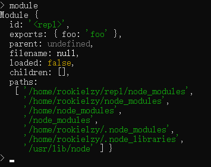
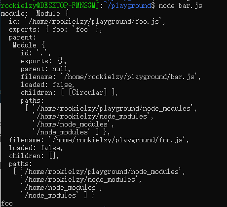
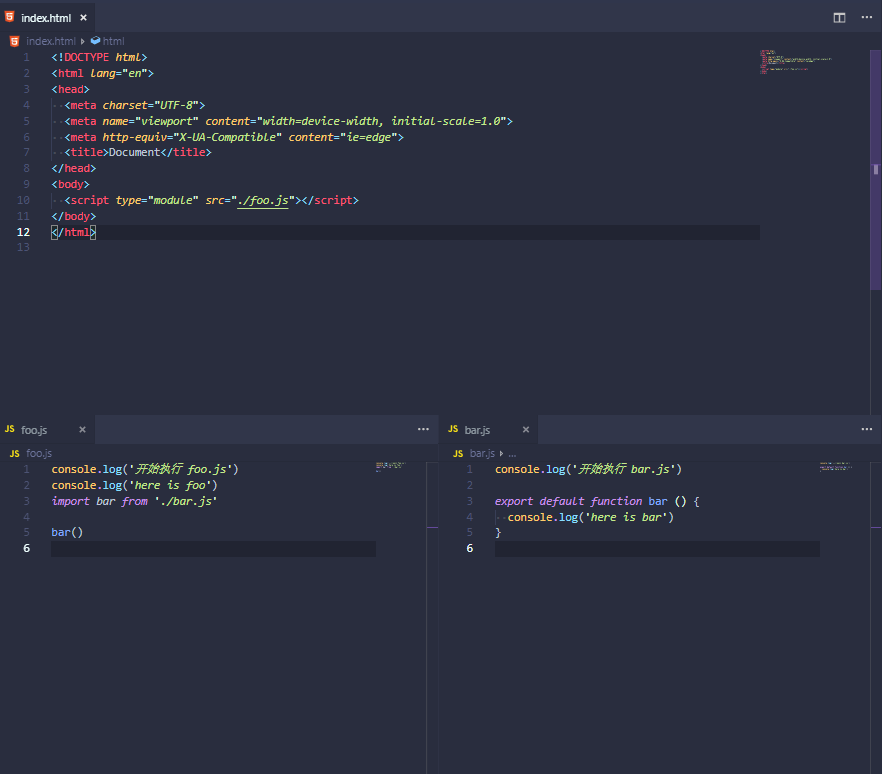
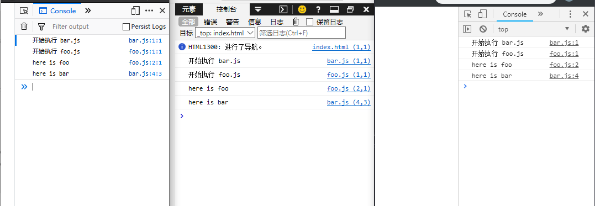
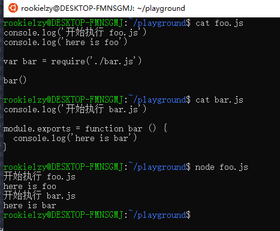

# 模块化(Module)

我们可能经常听到一些模块化的概念，譬如 `AMD`、`CommonJS` 或 `ES Modules`。这些又是什么概念呢？它们为什么而存在，作用又是什么呢？本文将对模块化的概念进行逐一分析。

## 为什么需要模块化

在了解模块化的概念前，首先先解决一个问题 - 为什么需要模块化？

先从实际问题出发，在类似 `require.js`、`sea.js`、`browserify`、`webpack` 等工具出现之前，我们可能会遇到如下一些问题：

* 我们在引用不同的库或者 `js` 文件时，可能会出现命名冲突。
* 引用的库或者文件都会有个先来后到，那如何去决定与维护这些顺序呢？
* 库与库之间、文件与文件之间可能存在循环引用，即在 `a.js` 中引用了 `b.js`，而 `b.js` 中也引用了 `a.js`；两者相互依赖。那我们如何决定先引用哪个件呢？

我们再从一个生活中的例子出发，简要了解一下模块化的优点，即为什么需要模块化的原因。

假设你有一套修理工具箱，里面包含了属于这套修理工具箱的各种型号的螺丝批、钳子和锤子等等。每次家里水管破了，灯泡坏了什么的，你都可以拿这套修理工具箱进行修理。每次修理可能都会造成一些工具的损耗或损坏，损坏之后我们就应该去买相同型号的工具进行补充；其他不对头的工具不会回收回这套修理工具箱中，同样这套修理工具箱中的工具也不会随意扔出工具箱中。

我们把上述例子转化为模块化来看看。首先，修理工具箱就是 `模块`，里面的工具就是 `模块` 中的各种变量或函数。工具出现损坏等于 `模块` 内出了什么问题，这时候我们只需要修复 `模块` 内的 `bug` 就好了。其他不对头的工具不会回收回工具箱中，反之工具箱中的工具不会随意被扔出表示 `模块` 内的变量、函数等不会污染外部的变量、函数等等，反之亦然。这套工具箱可以重复利用也就是 `模块` 的复用性很强。

总结模块化有三大优点：

* 可维护性强，更新或修复模块内的逻辑不会影响外部逻辑
* 独立的命名空间，模块内的变量不会污染外部的变量，即使它们拥有相同的变量名
* 可复用性强，我们需要在不同的地方用到某个模块，只需要在对应的地方引入它就行了，无需重复地拷贝复制。

## 什么是模块化

接下来将会通过一些常见的例子与概念来解释什么是模块化。注意，闭包在模块化中有着重要的应用，这里假设你对闭包概念已有所了解。

### `IIFE` - 立即执行函数表达式

顾名思义，立即执行函数表达式就是一个函数在定义时就会立即执行。

```js
var global = "I'm global"

(function () {
  var foo = 'foo'

  function bar () {
    console.log('bar')
  }

  console.log(foo)

  bar()

  console.log(global)
})()
// foo
// bar
// I'm global

var foo = 'global foo'
console.log(foo)  // global foo
bar() // Uncaught ReferenceError: bar is not defined
```

可以看到，我们在立即执行函数表达式的外部访问其变量会抛出错误，而在立即执行函数表达式的内部可以随时访问外部变量。外部与立即执行函数表达式同样有命名为 `foo` 的变量，但这两者互不影响。其实这种行为就类似于 `C++` 等语言中类的私有变量、私有方法。

当然我们还可以让立即执行函数表达式放回一些东西，类似类的暴露公共方法、变量的概念。

```js
var module = (function () {
  var _privateCnt = 0
  var _privateProperty = 'I am private property'

  function _privateCnter () {
    return _privateCnt += 1
  }

  function publicCnter () {
    return _privateCnter()
  }

  return {
    property: _privateProperty,
    publicCnter: publicCnter
  }

})()

console.log(module.property) // I am private property
console.log(module.publicCnter()) // 1
console.log(module.publicCnter()) // 2
console.log(module.publicCnter()) // 3
```

这个例子展示了通过立即执行函数表达式将一些变量、方法暴露出去，并防止外部直接修改一些我们不希望修改的变量、方法。这样做还有一个好处，就是我们可以快速地了解到这个立即执行函数为我们提供了哪些公共属性及方法，而不需要阅读所有逻辑代码。这种方式在设计模式中也称作 `模块模式（Module Pattern)`。

### `CommonJS`

`CommonJS` 主要是为服务端定义的模块规范，它一开始的名字为 `ServerJS`。`npm` 生态系统基本都是基于 `CommonJS` 规范所建立起来的。

```js
// 在 foo.js 中，我们导出了变量 foo
module.exports = {
  foo: 'foo'
}

// 在 bar.js，我们通过 require 引入了变量 foo
var module = require('foo')
console.log(module.foo) // foo
```

看起来很简单是吧。可能有人会问了，这个 `module` 是什么东西呢？其实 `module` 是 Node 中的一个内置对象。我们可以在 `node` 环境下打印看看



我们可以看到 `module` 有好几个属性，其中 `id` 是为了让 `node` 知道这个模块在哪里，是啥；`exports` 就是我们要导出的对象了。

在确保 `foo.js` 和 `bar.js` 在同一目录下，我们再将例子稍加修改：

```js
// foo,js
module.exports = {
  foo: 'foo'
}
console.log('module: ', module)

// bar.js
var module = require('./foo')
console.log(module.foo)
```

运行 `node bar.js` 可以得到以下信息：



通过 `CommonJS` 规范定义的模块同样有一开始说到的模块的三大优点，其实我们只需要把这些模块文件看出一个个立即执行函数，也就会很好理解了。

在 `CommonJS` 里模块都是同步加载的，在浏览器中如果同步去加载模块的话会造成阻塞，导致页面性能下降；而在服务端中，因为文件都存在于同一个硬盘上，所以即使是同步加载都不会有什么影响。

再补充一个小细节，你可能时不时能看到 `var exports = module.exports` 这样的代码。或许你会问为什么要怎么做，难道有什么技巧吗？其实这只是简单的引用而已。即变量 `exports` 同样指向了 `module.exports` 的内存地址，也就是两者指向的对象是完全一样的。我们想在 `module.exports` 里添加导出的东西时，只需要在 `exports` 里加就行了。就是这么简单，只不过被一些说法搞得高深莫测了而已。

```js
var exports = module.exports

exports.foo = 'foo''
```

### `AMD - Asynchronous Module Definition`

刚刚我们说到 `CommonJS` 主要是用于服务端的规范，而客户端是无法使用它的，并且 `CommonJS` 是同步加载模块的。所以我们又有了叫做 `AMD` 规范的东西，也就是异步模块定义规范。顾名思义，我们可以利用这个规范来做到模块与模块的依赖可以通过异步的方式来加载；这也是浏览器（客户端）所希望的。

`AMD` 中的核心就是 `define` 这个方法。

```js
define(
  module_id,
  [dependencies],
  definition
)
```

其中 `define` 中的 `module_id` 与 `dependencies` 为可选参数。

首先 `module_id` 它是一个字符串，指的是定义的模块的名字，这个名字必须是唯一的。第二个参数 `dependencies` 是模块所依赖的模块组成的数组，并作为参数传入给第三个参数 `definition` 工厂方法中。第三个参数 `definition` 就是为模块初始化要执行的函数或对象。如果为函数，它应该只被执行一次。如果是对象，此对象应该为模块的输出值。

```js
// dep1
define('dep1', [], function () {
  return {
    doSomething: function () {
      console.log('do something')
    }
  }
})

define('dep2', [], function () {
  return {
    doOtherThing: function () {
      console.log('do other thing')
    }
  }
})

define('module', ['dep1', 'dep2'], function (dep1, dep2) {
  dep1.doSomething()
  dep2.doOtherThing()
})
```

虽然 `AMD` 规范提供了异步加载模块的方案，但是给我的感觉就是逻辑不如 `CommonJS` 直观。因此在 `ES6` 中也就有了原生的模块化： `ESM - ES Modules`。

### `ES Modules`

`CommonJS` 在服务端中应用广泛，但由于它是同步加载模块的，它在客户端不太合适；而 `AMD` 支持浏览器异步加载模块，但在服务端却显得没有必要，因此 `ES Modules` 出现了。我们先来看看 `ES Modules` 是如何工作的。

`ES Modules` 与 `CommonJS` 很相似，较新的浏览器均已支持 `ES Modules`，`Node.js` 正在慢慢支持相关规范。

`ES Modules` 的核心为 `export` 与 `import`，分别对应导出模块与导入模块。

导出模块：

```js
// CommonJS
module.exports = foo () {
  console.log('here is foo')
}

// ES Modules
export default function bar () {
  console.log('here is bar')
}
```

导入模块：

```js
// CommonJS
var foo = require('./foo')

foo() // here is foo

// ES Modules
import bar from './bar'

bar() // here is bar
```

这两者这么相似，它们在实际的表现上有什么不同呢？

我分别在 `Firefox`、`Edge` 和 `Chrome` 上测试（`Chrome` 由于自身的安全策略无法直接通过本地文件进行测试，所以利用插件 `Web Server for Chrome` 起了个本地服务器。

测试代码如下图（注意我们在使用 `ES Modules` 时要给 `script` 标签加上 `type="module"`）



测试的结果显示为：



```js
开始执行 bar.js
开始执行 foo.js
here is foo
here is bar
```

如果我们使用 `CommonJS` 又会有什么结果呢？



```js
开始执行 foo.js
here is foo
开始执行 bar.js
here is bar
```

很显然 `CommonJS` 是同步加载模块的，所以代码的执行也是顺序的。而 `ES Modules` 是异步加载模块的，且 `ES Modules` 是编译时加载模块，在运行时（执行代码时）再根据相关的引用去被加载的模块中取值。再详细一点来说的话，整个过程分如下三个步骤：

* 构建 - 查找、下载并将文件解析到模块记录中
* 实例化 - 在内存中找到所有导出（export）的值的位置，但暂不对这些值进行赋值；然后在内存中创建 `exports` 和 `imports` 的空间。这一步称为链接
* 运行 - 运行代码并将实际的值赋予给实例化中导出的值

[ES Modules 解析的相关参考文章](https://hacks.mozilla.org/2018/03/es-modules-a-cartoon-deep-dive/)

因此在编译期间，编译器先找到了 `foo.js` 的依赖 `bar.js`，先编译 `bar.js` 然后才是 `foo.js`。所以你才会先看到 `开始执行 bar.js`。

## 总结

* 模块化简单来说就是将相关的逻辑代码独立出来，独立的形式有很多种，可以是单纯的一个函数，亦可以是单独的一个文件。
* 模块化可以更好地组织代码结构，增强其可维护性，可复用性强。
* `CommonJS` 工作原理为同步加载模块，在 `Node.js` 中有着广泛的使用，对客户端不友好。
* `AMD` 工作原理为异步加载模块。
* `ES Modules` 为 `ES6` 推出的规范，客户端的支持比较好，`Node.js` 将会慢慢全面支持。它与 `AMD` 一样，也是异步加载模块。
