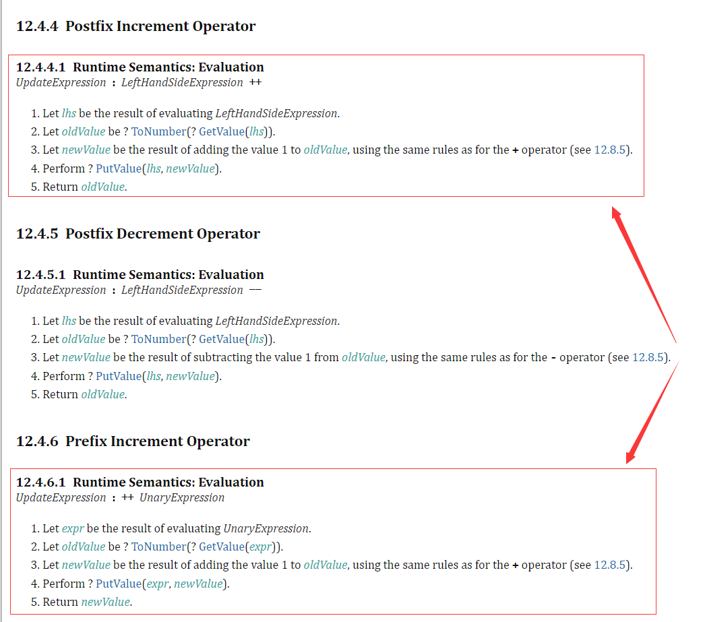
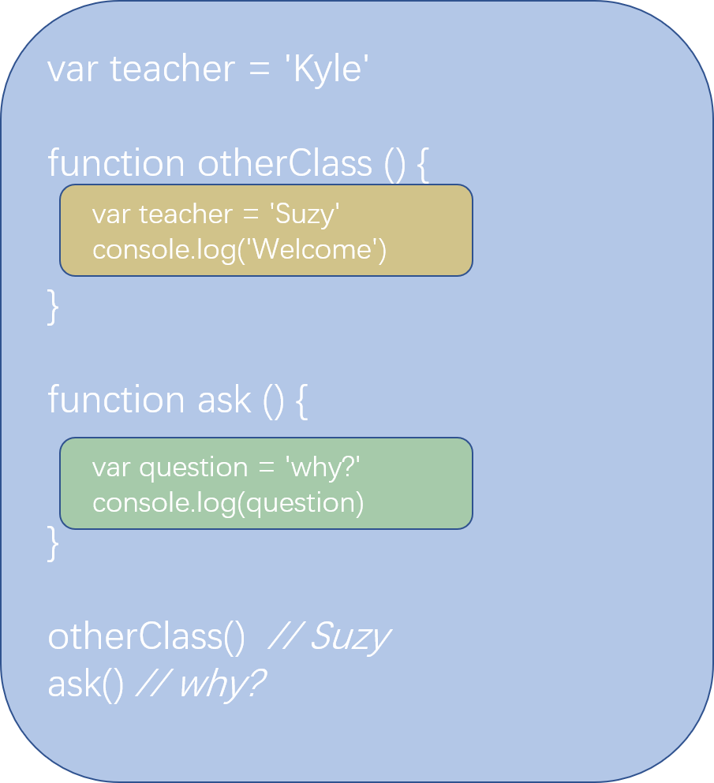
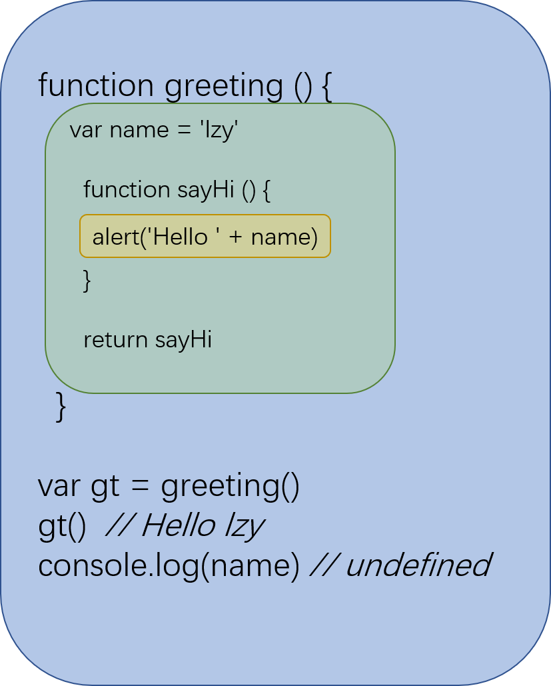

# Ah Shit, Here We Go Again

## Understanding your code

在我们进行编码前，我们必须先明确我们要实现的功能、业务是什么。就像数学题一样，我们要先明确问题（输入）与答案、结果或预期（输出）；不能像个无头苍蝇一样，还没搞清楚前提就埋头编码。

除此之外，还有一个非常重要的点就是我们要明确我们编码的细节，明白自己写的代码是如何工作的。听起来像是废话对吧，我们来看下面一个例子。

```js
var a = 1;
var b = ++a;
var c = a++;

console.log(a, b, c)  // 3 2 2
```

打印出来为什么是 `3 2 2` 呢？其中的 `++a` 和 `a++` 到底有什么区别呢？这里我将直接引用 `ECMA-262` 中的定义来解释：



这两者最直接的区别就在于 `a++` 返回的结果为自增前的值，而 `++a` 返回的结果为自增后的值。

这个结论是否与你预期的一样呢？如果不一样，那么就说明了你对这方面的知识欠缺。有不少人在看见程序、功能正常运行时就认为没问题了，后续出现了 bug，找起来就会非常费劲。所以对于自己写的代码，一定要心知肚明，不能敷衍；就好像你在面试时，面试官问你为什么这么写，你总不能简单回答因为这样能正常运行吧。

未来遇到不其他不同的问题，我们可以先去查阅一下类似 `MDN` 的文档，虽然不一定正确。总之如果出现了一些文档与你的心里预期不一致，建议查阅 `ECMA-262` 中相关的定义及规范。

## About JavaScript

在我们使用任何前端框架前，我们都必须先把最基本的 `JavaScript` 吃透。其中 `JavaScript` 基础知识点可以拆分为三大部分：`类型系统（Types System）`、`作用域系统（Scope System）` 和 `对象系统（Objects System）`。接下来我们所有内容将由这三大部分进行展开探讨。

## Types

首先我们要明确一点，在 `JavaScript` 中，变量是没有类型的，但值有类型之分。

 `JavaScript` 中的类型可以分为两大类，即原始类型（Primitive Type）和对象类型（Object Type）；也就是说如果一个值不是原始类型的话，那它必然是对象类型。简单的区分方法就是原始类型没有任何函数可以进行调用的。

不知道有没有同学听说过 `JavaScript` 中只有对象类型一种数据类型。为什么会有这种不正确的说法呢？主要是因为属于弱类型语言的 `JavaScript` 它的原始类型有时候会表现得像对象类型一样。如下例子所示：

```js
var a = 1
typeof a // "number"
a.toString()  // "1"
```

变量 `a` 的值明明就是 `number` 类型，为什么可以调用 `toString()` 呢？这就是 `JavaScript` 在背后先把值转为了对象类型，然后进行函数调用，最后由将值的类型恢复原状。类似的例子有很多，大家可以多多挖掘。

### 原始类型（Primitive Type）

> 除 Object 以外的所有类型都是不可变的（值本身无法被改变）。例如，与 C 语言不同，JavaScript 中字符串是不可变的（译注：如，JavaScript 中对字符串的操作一定返回了一个新字符串，原始字符串并没有被改变）。我们称这些类型的值为“原始值”。 --- MDN

```js
var a = 'abc'
a[1] = 'd'
console.log(a)  // abc
```

原始类型的值都会存放在栈内存中，因此我们读取原始类型的值会非常地快。

* `boolean` 仅包含两个值：`true` 和 `false`
* `number`  用于整数和浮点数
* `string`  用于字符串。一个字符串可以包含一个或多个字符，所以没有单独的单字符类型
* `undefined` 用于未定义的值 —— 只有一个 undefined 值的独立类型
* `null`  用于未知的值 —— 只有一个 null 值的独立类型
* `symbol`  用于唯一的标识符
* `bigint` 一种用于表示任意精度的数字类型

那我们一般用什么方法来检测一个值是否为原始值呢？

### `typeof`

> `typeof` 操作符返回一个字符串，表示未经计算的操作数的类型。 --- MDN

`typeof` 主要用于检查原始类型。除了 `null` 之外它都能正确返回对应的原始类型。在用 `typeof` 来检查对象类型时，他不只会返回 `object`。譬如检查函数时，它会返回 `function`；其他的对象类型均返回 `object`。

```js
var a = true
typeof a // "boolean"

a = 1
typeof a // "number"

a = "1"
typeof a // "string"

a = undefined
typeof a // "undefined"

a = null
typeof a // "object"

a = Symbol(1)
typeof a  // "symbol"

a = BigInt(1)
typeof a // "bigint"
```

其中 `typeof null` 结果为 `object`，但实际上它是原始类型。这是因为 `JavaScript` 历史遗留的 bug。同样 `typeof Function()` 结果为 `function`，但实际上 `function` 并非原始类型或对象类型的一种，它只是对象类型的一种子类型。这都是历史遗留的问题，我们无法去解决它，因为修复这些问题可能会导致一堆新的问题的出现。

### `undefined` & `undeclared` & `uninitialized`

在 `JavaScript` 中 `undefined` 是作为原始类型显式存在的，譬如我们定义一个变量但不进行赋值，这时候这个变量的值就为 `undefined`。

但 `未声明（undeclared）` 又是怎么回事呢？`undeclared` 在 `JavaScript` 中是不存在的，但有些行为应该属于 `undeclared`，但 `JavaScript` 帮我们做了处理，也使得我们认为这种行为是不存在的。

最后的 `uninitialized` 又是怎么回事呢？有了解过 `ES6` 的同学应该都听说过“暂时性死区” 即 `TDZ`，在 `JavaScript` 中也就表示为变量未初始化，任何访问这个变量的行为都将导致报错。

```js
var a
console.log(a)  // undefined

typeof b  // undefined (in fact it's undeclared)

console.log(c)  // Uncaught ReferenceError: Cannot access 'c' before initialization
let c
```

### `NaN` & `isNaN`

原始类型中我们要注意一些特殊的值，由于它们的行为表现的特殊性，在实际代码的编写过程中很有可能会因此产生 bug。这里我们来看看关于 `number` 的特殊值 `NaN`。

`NaN` 并不是表示 `Not a Number`，应该表示为非法数字，也属于数字类型的一种；它也是唯一一个自身不相等的值。

```js
var test = Number('test') // NaN

test === test // false
```

那么如何判断值是否为 `NaN` 呢？`JavaScript` 最早为我们提供了 `isNaN` 方法来做判断。但这个方法仍然有缺陷，我们通过下面的例子来看看：

```js
isNaN('a')  // true
isNaN(1)  // false
isNaN('1')  // false (wtf???)
isNaN('') // false (wtf???)
```

前面两个例子很直观，也很好理解。那后两者又是怎么回事呢？其实就是 `isNaN` 在做判断前会对判断的值进行隐式类型转换，会先转为 `number` 类型在做判断。那最后一个又怎么回事呢？其实万恶之源就是空字符串它本身。这里只做简单的解释，更详细的例子及解释将在后续展开。

为什么会说空字符串是万恶之源呢？其实很好理解，既然 `isNaN` 会做隐式的类型转换，那么 `Number("")` 返回 `0`，`Number("0")` 也返回 `0`；难道空字符串 `""` 可以用数字 `0` 来表达吗？当然不行！不过 `JavaScript` 没有提供更好的选择给我们。

那有没有可靠的方法来判断一个值是否为 `NaN` 呢？答案就是 `Number.isNaN`，它可以确定传递的值是否为 `NaN` 和其类型是 `Number`；并且它不会将传入的值强制转换为数字类型。

```js
Number.isNaN('')  // false (not a number)
Number.isNaN(1) // false (not NaN)
Number.isNaN(0 / 0) // true (belong to number & not NaN)
```

### `-0` & `+0`

在 `JavaScript` 中，数字都是浮点数，根据 `IEEE 754` 浮点运算标准以双精度编码。这里对部分没有 `C\C++` 等语言基础的同学可能会很陌生，不过不要紧，现阶段你只需要记住它就行了。[参考 IEEE 754 维基百科](https://zh.wikipedia.org/wiki/IEEE_754)

简单来说就是在 `JavaScript` 中，数字的二进制的首位字节表示了数字的符号（1 表示 -，0 表示 +）。一般来说 `+` 不需要显式展示，因此 `+0` 也就表示为 `0`。但这个 `-0` 就比较特殊了，请看下面的例子：

```js
-0 === 0  // true
-0 > 0  // false
-0 < 0  // false
Math.sign(-0) // -0
Math.sign(0)  // 0
```

看了上述例子是不是感觉很奇怪？即使严格相等不会进行隐式类型转换（关于类型转换在后续会有详细介绍），但 `-0 === 0` 仍然返回 `true`；这里也说明了严格相等其实并不严格。那我们需要怎么来更好的进行判断呢？答案就是 `Object.is`，用于判断两个值是否是相同的值。

```js
Object.is(-0, 0)  // false
Object.is(-0, -0) // true
Object.is(0, +0) // true
Object.is(NaN, 0 / 0) // true
```

### 关于原始类型的小结

文章到此，我们了解了在 `JavaScript` 中有哪些原始类型，并且分析了 `typeof` 的应用；还有一些特殊值的特殊表现（`undefined`、`NaN`、`-0`）。这些基础内容看似简单且枯燥，但又时时刻刻在代码中有所体现，因此我们也不应该忽视它们。最后再来一道练习题：

```js
// Object.is 是 ES6 推出的，因此不一定所有的浏览器都能支持，这里需要你自己来实现一个 Object.is

/*
  要求：
  1. Object.js 应该接收两个参数
  2. 如果两个值完全相等，那么结果应该返回 true，不能单纯使用 === 来判断，原因你应该明白
  3. 对于 NaN，你可以使用 Number.isNaN 来判断，不过是否能不使用内置方法来判断呢？
  4. 对于 -0，这个就确实没有内置方法判断了，不过你可以借助 `-Infinity` 来做判断
  5. 如果需要判断的值不适用于上述情况，那么你就可以使用 === 来做判断了
*/

function ObjectIs (x, y) {}

console.log(ObjectIs(42, 42) === true)
console.log(ObjectIs("foo", "foo") === true)
console.log(ObjectIs(false, false) === true)
console.log(ObjectIs(null, null) === true)
console.log(ObjectIs(undefined, undefined) === true)
console.log(ObjectIs(NaN, NaN) === true)
console.log(ObjectIs(-0, -0) === true)
console.log(ObjectIs(0, 0) === true)

console.log(ObjectIs(-0, 0) === false)
console.log(ObjectIs(0, -0) === false)
console.log(ObjectIs(0, NaN) === false)
console.log(ObjectIs(NaN, 0) === false)
console.log(ObjectIs(42, "42") === false)
console.log(ObjectIs("42", 42) === false)
console.log(ObjectIs("foo", "bar") === false)
console.log(ObjectIs(false, true) === false)
console.log(ObjectIs(null, undefined) === false)
console.log(ObjectIs(undefined, null) === false)
```

## Coercion

在我们做一些抽象运算时（例如加减乘除等），经常会发生一些值得类型转换；如果我们不清楚其转换规则，那么代码结果将难以预测，也就为程序挖下大大小小的坑。那么值之间的转换规则又是怎么样的呢？

这里我们将主要介绍以下几类：

* `ToPrimitive`
* `ToString`
* `ToNumber`
* `ToBoolean`

### `ToPrimitive`

`ToPrimitive` 顾名思义，就是转换为原始类型。为什么会有这种说法呢？首先我们先要明确 `JavaScript` 的抽象运算是指原始类型之间的运算。即当对象类型进行抽象运算时，`JavaScript` 会将对象类型转换为原始类型再进行运算；如果无法转换为原始类型，那么程序就会抛出错误。

既然对象类型进行抽象运算时会被转换为原始类型，那我们又怎么知道这些对象类型会转换为哪种原始类型呢？

首先我们要明确抽象运算的对象有个期望值，这个期望值又是怎么回事呢？举个简单的例子，我们都知道数学中的减法在 `JavaScript` 只适用于数字类型；当我们用对象类型来做减法运算时，`JavaScript` 就会期望这个对象类型能转换为数字类型，然后进行运算。

```js
var a = {
  a: 1
}

console.log(a - 1)  // NaN
```

上述的例子中，在执行 `a - 1` 时，首先 `JavaScript` 会先执行将 `a` 转换为数字类型，也就变成了 `NaN`，最后执行了 `NaN - 1` 结果也就为 `NaN`。

重点来了，`ToPrimitive` 中的期望值有如下三种：

* `string`
* `number`
* `default`

#### `default`

其中 `default` 这个期望值出现的情况特别少，也就是 `JavaScript` 也不确定期望值是什么。譬如数学计算中的加法是同时适用于字符串类型和数字类型的。根据 `ECMA-262` 中的定义，遇到这种情况，大部分情况下都将期望视为数字类型。除了一些对象类型自己定义的转换方法，还有 `Date` 和 `Symbol` 对象比较特殊，均覆写了默认的转换行为。

> When ToPrimitive is called with no hint, then it generally behaves as if the hint were Number. However, objects may over-ride this behaviour by defining a @@toPrimitive method. Of the objects defined in this specification only Date objects (see 20.3.4.45) and Symbol objects (see 19.4.3.5) over-ride the default ToPrimitive behaviour. Date objects treat no hint as if the hint were String. --- [ECMA-262 ToPrimitive NOTE](https://www.ecma-international.org/ecma-262/10.0/index.html#sec-type-conversion)

```js
var a = {
  a: 1
}

a == 'a'  // false
a > 1 // false
```

#### `string`

期望值为 `string` 时的情况就比较常见了，如下面的例子所示：

```js
var a = {
  a: 1
}
alert(a)  // [object Object]

var b {}
b[a] = 123

console.log(b)  // { [object Object]: 123 }

a + 1 // [object Object]1
```

#### `number`

期望值为 `number` 时的情况也同样很常见，如下面的例子所示：

```js
var a = {}
console.log(+a) // NaN

a - 1 // NaN
a > 1 // false
```

#### 转换规则

`ToPrimitive` 中就只有以上三种期望值，对于 `default` 这种比较少见的情况，我们一般都视为期望值为 `Number`。不过不用担心对于这类转换拿捏不准，接下来就是介绍具体的转换规则了

在正式介绍转换规则前，我们先了解关于 `Date` 和 `Symbol` 对象这两种特殊情况。

对于 `Date`，我们在对这类对象进行数学计算（减法或数学函数）时，这时候日期对象会转换为数字时间戳，然后再进行计算。而进行加法或其他期望为字符串类型的操作时，日期对象就会转换为详细时间字符串，再进行计算。

```js
var date1 = new Date('2019-09-23')
var date2 = new Date('2019-09-24')

console.log(date2 - date1)  // 86400000

console.log(date1 + 1)  // Mon Sep 23 2019 08:00:00 GMT+0800 (GMT+08:00)1
```

对于 `Symbol` 对象，在 `MDN` 中有如下定义：

> `Symbol.toPrimitive` 是一个内置的 `Symbol` 值，它是作为对象的函数值属性存在的，当一个对象转换为对应的原始值时，会调用此函数。 --- MDN

即，如果一个对象类型定义了这个属性值，那么在做类型转换时就会先通过这个属性来判断，这个属性默认会接收一个期望值 `hint`，如下例子所示：

```js
var a = {
  [Symbol.toPrimitive](hint) {
    if (hint == 'number') {
      return 1
    }
    if (hint == 'string') {
      return 2
    }
    if (hint == 'default') {
      return 3
    }
  }
}

console.log(+a) // 1
alert(a)  // 2
a + 1 // 4
```

介绍完上述的特殊情况后，我们就来看看一般情况的规则是怎么样的？

因为大多数情况下，我们不会去定义一个对象的 `[Symbol].toPrimitive` 属性，那如果没有这个属性有应该怎么判断转换规则呢？

首先，你需要知道 `Object` 对象内置有两种方法 `toString` 和 `valueOf`，其他类型的对象都会继承这两种方法。有了上面期望值的基础后，我们就可以很快速的判断对象类型在做类型转换时是怎么回事了。如下例子所示：

```js
var a = {
  toString() {
    return 'string'
  },
  valueOf() {
    return 123
  }
}

+a // 123 期望为 number
a + 1 // 124 期望不明确，即 default
alert(a)  // string 期望为 string

var b = {}

+b  // NaN
b.valueOf() // {}
Number(b.valueOf) // NaN
alert(b)  // [object Object]
b.toString()  // [object Object]
```

总结来说转换的规则如下：

1. 调用 `obj[Symbol.toPrimitive](hint)` 如果这个方法存在的话
2. 否则如果期望是 `"string"`
   * 尝试 `obj.toString()` 和 `obj.valueOf()`，无论哪个存在
3. 否则，如果期望是 `"number"` 或者 `"default"`
   * 尝试 `obj.valueOf()` 和 `obj.toString()`，无论哪个存在

### Last of Three

介绍完 `ToPrimitive` 后，我们就来看看另外三个常见的类型转换：

* `ToString` - 输出内容时 `ToString` 发生转换，或通过 `String(value)` 进行显式转换。原始类型值的 `string` 类型转换通常式可预见的。即 `null` 变成 `"null"`，`true` 变成 `"true"。

* `ToNumber` - 进行算术操作时发生 `ToNumber` 转换，或通过 `Number(value)` 进行显式转换。
* `ToBoolean` - 进行逻辑操作时发生 `ToBoolean` 转换。或通过 `Boolean(value)` 进行显式转换。

#### `ToString`

[ToString ECMA参考](https://www.ecma-international.org/ecma-262/9.0/index.html#sec-tostring)

| 原始值                                             | 转换后的值       |
| -------------------------------------------------- | ---------------- |
| `undefined`, `null`, `boolean`, `number`, `string` | 所见即所得       |
| `symbol`                                           | 抛出 `TypeError` |

特殊情况：

* -0 --> "0"
* 当我们对数组做 `ToString` 的处理时，`JavaScript` 会将方括号和 `undefined`、`null` 过滤掉
* 当我们对普通对象做 `ToString` 的处理时，`JavaScript` 会加上方括号

```js
String([]) // ""
String([1,2,3]) // "1,2,3"
String([null, undefined]) // ","
String([[[], [], []], []]) // ",,,"
String([,,,,]) // ",,,"
String([1, null, undefined]) // "1,,"

String({}) // "[object Object]"
String({a:2}) // "[object Object]"
String({toString(){return "X"}}) // "X"
```

#### `ToNumber`

[ToNumber ECMA参考](https://www.ecma-international.org/ecma-262/9.0/index.html#sec-tonumber)

| 原始值       | 转换后的值                                                             |
| ------------ | ---------------------------------------------------------------------- |
| `undefined`  | `NaN`                                                                  |
| `null`       | `0`                                                                    |
| `true/false` | `1/0`                                                                  |
| `string`     | 字符串“按原样读取”，两端的空白被忽略。空字符串变成 0。出错变成 NaN。 |
| `Symbol`     | 抛出 `TypeError`                                                       |

对 `true` 和 `false` 做 `ToNumber` 处理时分别返回 `1` 和 `0`，看起来也算是挺正常；因为其他不少编程语言中 `0` 和 `1` 也表示了 `true` 和 `false`。

`null` 会变成 `0`，额，看起来也没什么问题；但是为什么 `undefined` 会变成 `NaN` 呢？这两个为什么不统一起来呢？

当我们对数组或者普通对象类型做 `ToNumber` 处理时，它的期望值为 `number`，因此它会首先调用 `valueOf`，如果我们没用覆写这个方法的话，`valueOf` 将会返回 `this`；这时候仍然没有得到期望值的类型，进而它会调用 `toString`。

这里要再次注意万恶之源 - 空字符串，如果你还有印象，在前面的章节我们也有提及过；这里再次补充说明，空字符串不只是 `''` 一种情况，还包含了空格、换行、缩进等字符串。它们在进行 `ToNumber` 的操作时均会被转为 `0`。

```js
Number("") // 0
Number("0") // 0
Number("-0") // -0
Number(" 009 ") // 9
Number("3.14159") // 3.14159
Number("0.") // 0
Number(".0") // 0
Number(".") // NaN
Number("0xaf") // 175
Number("    \t\n") // 0

Number(false) // 0
Number(true)  // 1
Number(null)  // 0
Number(undefined) // NaN

var a = {
  toString() {
    return 123
  }
}

Number(a) // 123
Number([""]) // 0
Number(["0"]) // 0
Number(["-0"]) // -0
Number([null]) // 0
Number([undefined]) // 0
Number([1,2,3]) // NaN
Number([[[[]]]]) // 0
```

上述的例子中后面几个关于对象的例子是不是感觉有点迷惑。为什么 `[null]` 和 `[undefined]` 都会返回 `0` 呢？结合前面的描述，你就可以很好的理解其原因了。

`Number([null])` 和 `Number[undefined]` 实际上等于 `Number([null].toString())` 和 `Number([undefined].toString())`，其中内部的值都变成了万恶之源 - 空字符串。

#### `ToBoolean`

[ToBoolean ECMA参考](https://www.ecma-international.org/ecma-262/9.0/index.html#sec-toboolean)

| 原始值                                | 转换后的值 |
| ------------------------------------- | ---------- |
| `0`, `null`, `undefined`, `NaN`, `""` | `false`    |
| 其他值                                | `true`     |

这个情况就简单多了，只需要了解其规则即可，也没有什么特殊、迷惑人的情况出现。

### 关于类型转换小结

或许你阅读了上述的内容后会觉得 `JavaScript` 不严谨的地方太多了，有点类似暴雪教玩家玩游戏的味道；但你必须接受它，这些都属于 `feature` 而不是 `bug`。我们在编写代码的过程中，或多或少会涉及到类型转换，或是显式转换，或是隐式转换；如果一段代码在不够清晰的情况下，最好能做显式转换，避免造成阅读困扰。

### `==` & `===`

在实际的编码中，类型转换的多发地带之一就是相等比较。大部分人应该都知道 `==` 为非严格相等，`===` 为严格相等；两者其中一个区别就是严格相等要求值与值得类型都相等。除此之外还有什么区别呢？什么时候该用 `==`，什么时候又该用 `===` 呢？

首先我们要明确在进行 `==` 值比较时，有可能会发生类型转换。我们来看看 `ECMA-262` 中是如何定义的：

1. 如果 `x` 和 `y` 的类型相同，那么它们比较返回的结果将和严格相等一样 `x === y`
2. 如果 `x` 为 `null`，`y` 为 `undefined`，返回 `true`
3. 如果 `x` 为 `undefined`，`y` 为 `null`，返回 `true`
4. 如果 `x` 的类型为 `Number`， `y` 的类型为 `String`，返回 `x == ToNumber(y)`（将 `y` 转换为数字类型）的对比结果
5. 如果 `x` 的类型为 `String`， `y` 的类型为 `Number`，返回 `ToNumber(x) == y` 的对比结果
6. 如果 `x` 的类型为 `Boolean`，返回 `ToNumber(x) == y` 的对比结果
7. 如果 `y` 的类型为 `Boolean`，返回 `x == ToNumber(y)` 的对比结果
8. 如果 `x` 属于 `String`，`Number` 或 `Symbol` 中的一种，且 `y` 的类型为 `Object`，返回 `x == ToPrimitive(y)`（将 `y` 转换为原始类型）的对比结果
9. 如果 `x` 的类型为 `Object`，`y` 属于 `String`，`Number` 或 `Symbol` 中的一种，返回 `ToPrimitive(x) == y` 的对比结果
10. 如果不符合上述条件，返回 `false`

对于严格相等来说就没有这么多的条件判断了，比较的双方必须类型与值都相同才返回 `true`，否则返回 `false`。

需要注意的一点是如果两个值作比较，假设 `x` 为 `Number` 类型

1. 如果 `x` 为 `NaN`，返回 `false`
2. 如果 `y` 为 `NaN`，返回 `false`
3. 如果 `x` 与 `y` 的值相同，返回 `true`
4. 如果 `x` 为 `+0`，`y` 为 `-0`，返回 `true`
5. 如果 `x` 为 `-0`，`y` 为 `+0`，返回 `true`
6. 如果不满足上述条件，返回 `false`

[ECMA-262 Abstract Equality Comparison](https://www.ecma-international.org/ecma-262/9.0/index.html#sec-abstract-equality-comparison)

从上述的内容中，我们可以清楚地了解到在使用 `==` 时，如果是相同的类型，其结果与 `===` 一样；否则就会发生类型转换。上述的内容也可以总结为如下内容：

如果比较的值的类型相同，那么就和 `===` 结果一致；如果比较的值为 `null` 或 `undefined`，那它们相等；如果比较值非原始类型，那么就要将其转换为原始类型再做比较，期望值为数值类型（`ToNumber`）。

接下来我们来看看两个比较特殊的例子来加深理解：

```js
[] == ![] // true 为什么会返回 true 呢？
// [] == false  首先 JS 先将右边的值转换为 boolean 类型
// 0 == false 然后 JS 将左边的值转换为原始类型，期望值为 number
// 0 === 0  最后将右边的值转换为与左边值相等类型的值，即期望值为 number
// true 两者的类型已相等，也就可以使用 === 来判断

[] != []  // true 这个例子有为什么是返回 true 呢？对于有引用概念理解的同学应该能很快判断出来，因为它们指向的并非同一对象。
// !([] == [])
// !(false)
// true
```

在我们进行相等判断时，应该尽量避免一下情况：

1. 使用 `==` 与 `0` 或 ""，甚至是 " " 作比较
2. 使用 `==` 与非原始类型值作比较
3. `== true` 或 `== false`

同时要尽量遵循如下要求:

1. 不要在不知道值的类型的情况下使用 `==`
2. 不是大部分情况下需要使用 `===`，用 `==` 更简洁

小结：上述内容大部分涉及的是原始类型之间或原始类型与对象类型之间的判断；而对象类型的判断是不是很复杂呢？并不是的，相反它们是最简单的。因为对象变量存储的是对象值的引用（即内存地址），不同的对象，即使看起来长得一样，它们的内存地址都是不一样的。（`{} === {} false`）这些内容会在后续的对象类型详细介绍。

### `TypeScript` & `Flow` 补充内容

`TypeScript` 与 `Flow` 都提供了静态类型检查，很大程度上能帮助我们避免潜在的 bug 的出现，也就增强了程序的健壮性。

现在前端生态越来越趋向 `TypeScript` 的普及与应用了，如果大家感兴趣的话，可以阅读 [这篇 TypeScript 入门教程](https://github.com/xcatliu/typescript-tutorial)

## Scope

在 `JavaScript` 一大重要的概念就是作用域。那么什么是作用域呢？在 `ECMA-262` 中我们是无法找到关于作用域的相关描述的，不过它确实存在与 `JavaScript` 中；作用域决定了你可以访问的变量。

> Scope determines the accessibility (visibility) of variables. --- [w3c school](https://www.w3schools.com/js/js_scope.asp)

为什么作用域会这么重要呢？因为我们常见的、后面也将介绍的嵌套作用域、变量提升、闭包和模块化都离不开作用域。

在 `JavaScript` 中，作用域分为三种：全局作用域（`Global Scope`）、局部作用域（`Local Scope`）及词法作用域（`Lexical Scope`）。局部作用域主要有：模块作用域（`Module Scope`）、块作用域（`Block Scope`）与函数作用域（`Function Scope`）。它就像集合，大集合中访问不到它的小集合的变量，而小集合可以访问大集合的变量。我们通过一个简单的例子来加深理解：

```js
var teacher = 'Kyle'

function otherClass () {
  var teacher = 'Suzy'
  console.log('Welcome')
}

function ask () {
  var question = 'why?'
  console.log(question)
}

otherClass()  // Welcome
ask() // why?
console.log(teacher)  // Kyle
```



首先，我们看到的就是在浏览器中最大的作用域 - `global`（全局作用域）也就是图中蓝色部分，在全局作用域中，我们定义了一个 `teacher` 变量，一个 `otherClass` 函数变量和一个 `ask` 函数变量。在定义函数变量时，编译器给这两个函数变量各自分配了它们的作用域，在图中分别为黄色部分和绿色部分。

在我们继续讲解作用域前，我们先来聊一聊 `JavaScript` 语言本身。或许你有听说过 `JavaScript` 是一种解释型语言，譬如 `Bash`；但实际上 `JavaScript` 是一种编译语言，或者严格来说 `JavaScript` 运行前先会被解析。为什么会有这样的结论呢？像 `Bash` 这种解释型语言，代码是一行一行执行的，如果后面的代码存在语法错误，也不影响前面的代码的执行；而 `JavaScript` 就不一样了，如下面例子所示：

```js
var a = 'a'
console.log(a)
a{} = 'b'
// Uncaught SyntaxError: Unexpected token '{'
```

我们是看不到 `console.log(a)` 的正常执行的。有了这个基础，我们就可以理解为什么前面会有“编译器给函数分配作用域”这种说法了。关于这部分内容，请参考 [You-Dont-Know-JS](https://github.com/getify/You-Dont-Know-JS/blob/2nd-ed/scope-closures/ch1.md#compiler-theory) 中关于编译器的内容介绍。

再回到作用域的话题，前面提到作用域有三种，一种为全局作用域，另一种为局部作用域，最后一种词法作用域。

### 局部作用域

我们先来看看较为简单的局部作用域：代码中有些变量只能在特定的范围才能访问，这个范围就称为局部作用域。这些变量也称为局部变量。

在 `JavaScript` 中有两种局部变量：

* 函数作用域
* 块作用域

#### 函数作用域(Function scope)

当你在一个函数里声明一个变量时，你只能在这个函数里访问它，无法在外部去访问这个变量。这就是函数作用域。

```js
function helloWorld () {
  const greeting = 'Hello World'
  console.log(greeting)
}

helloWorld()  // Hello World
console.log(greeting)  // Error: greeting is not defined
```

对于函数作用域，我们还可以细分为函数表达式和函数声明；其中函数表达式可以分为具名函数表达式和匿名函数表达式，`ES6` 中的箭头函数为匿名函数表达式的一种。下面我们来看看它们的区别：

```js
function funcDeclaration () {
  console.log('I am function declaration')
}

var namedFuncExpression1 = function namedFuncExpression1 () {
  console.log('I am a named function expression')
  console.log(namedFuncExpression1)
}

var namedFuncExpression2 = function diffNameFuncExpression () {
  console.log('I am a named function expression too')
  console.log(diffNameFuncExpression)
}

var anonymousFuncExpression = function () {
  console.log('I am a anonymous function expression')
}
var namedArrowFunc = () => {
  console.log('I am a arrow function')
}

funcDeclaration()
namedFuncExpression1()
namedFuncExpression2()
anonymousFuncExpression()
namedArrowFunc()
diffNameFuncExpression() // ReferenceError
```

我们可以看到函数声明的一大特征就是它是由 `function` 来定义的，且没有任何赋值操作。对于函数表达式，首先我们都是使用 `var` 等进行变量声明，但只有代码执行到赋值操作时，它们才成为函数对象。那么这两种函数作用域和所处的作用域又会有什么区别呢？

首先，显而易见，上述例子中的函数都有各自的函数作用域；它们也在同一个作用域中。但对于函数表达式，在其所处的作用域中是无法调用 `=` 右边的函数声明的。
就像 `namedFuncExpression1` 和 `diffNameFuncExpression`，它们的都处在它们 `=` 左边的作用域（函数作用域）中。为什么调用 `namedFuncExpression1` 不报错呢，因为实际调用的是函数表达式 `namedFuncExpression1`，它处于全局作用域下（上述例子情况下）。

除此之外，函数声明和变量声明 `var` 都会有变量提升的效果。在代码执行前，`JavaScript` 引擎就知道函数声明的变量为函数对象了，而 `var` 声明的变量会初始化为 `undefined`。这部分内容会在后续展开讨论。

#### 块作用域

当你在 `{}` 中使用 `let` 或 `const` 定义变量时，你只能在这个花括号里访问它。这也就形成了块作用域。由于 `JavaScript` 的变量提升机制，使用 `var` 并不会有相同的效果。

```js
{
  const a = 'a'
  console.log(a)  // a
  let b = 'b'
  console.log(b)  // b
  var c = 'c'
  console.log(c)  // c
}

console.log(c)  // c
console.log(a)  // Error: a is not defined
console.log(b)  // Error: b is not defined
```

实际上，块作用域是函数作用域的子集，因为声明函数需要花括号来声明（除了箭头函数的隐式声明）

### 词法作用域(Lexical Scope)

最后我们需要重点了解下词法作用域（嵌套作用域），当在一个函数里声明另一个函数时，内部的函数将能访问外部函数的变量。这种行为叫做词法作用域(lexical scoping)。它与全局作用域和局部作用域都有重合的地方，且它是闭包的一大基础。

词法作用域，其实就是编译器在对 `JavaScript` 代码进行词法分析时定义的作用域；也就说明这种作用域与它所处的位置有关。例如以下的例子所示：

```js
var a = 'a'

function foo () {
  console.log(a)
}

function bar () {
  var a = 'A'
  foo()
}

function baz () {
  var a = 'Aa'
  function foo1 () {
    console.log(a)
  }
  foo1()
}

foo() // a
bar() // a
foo1()  // Aa
```

或许你会有疑问，为什么 `bar()` 会打印出 `a` 呢？而 `baz()` 又打印出 `Aa` 呢？`bar` 里定义的 `var a = 'A'` 没有起作用吗？

其实结合刚刚我们对词法作用域的定义就很好理解了。

首先编译器对上述代码进行词法分析，其中重要的一步就是确定词法作用域。我们可以看到 `foo`、`bar` 和 `baz` 都在全局作用域下，它们分别有着自己的作用域，同时它们也有相同的词法作用域，即全局作用域。

在代码执行阶段，执行 `foo()` 打印 `a`，因为通过它所属的词法作用域能够找到全局作用域中定义的变量 `a`；在执行 `bar()` 时先定义了 `a = 'A'` 然后执行 `foo()`，`foo` 所属的词法作用域仍然为全局作用域并非 `bar` 的函数作用域，因此还是打印 `a`。最后的 `baz()`，我们可以看到在其内部定义了函数 `foo1`，因此 `foo1` 的词法作用域也就是 `baz` 的函数作用域；在执行 `foo1()` 时也是在其词法作用域中最先找到变量 `a`，因此打印 `Aa`。

到此，我们覆盖完了关于作用域的基础部分，接下来就是作用域衍生的内容，也是 `JavaScript` 中极其重要的内容，即变量提升、闭包与 `ES6` 提出的模块化。

## Hoisting

> Hoisting is JavaScript's default behavior of moving declarations to the top. --- from [w3c school](https://www.w3schools.com/js/js_hoisting.asp)

`JavaScript` 中有两种提升(hoisting)，变量提升(variable hoisting)和函数提升(function hoisting)。下面的内容将对这两种提升进行深入探讨。

### 什么是变量提升

***注意：这部分会有一些比较晦涩的名词出现，譬如词法环境，执行上下文等等；这里提供一个[参考资料](https://github.com/rookielzy/daily-blog/blob/master/About-JavaScript/execution-context.md)，更多内容也可以自行进行查阅。***

变量提升就是JS引擎会将所有变量声明提升到作用域的顶部，譬如 `var`、`const`、`let`之类的。等等，不是说`const` 和 `let` 是没有变量提升的效果的吗？其实并不是。在 `ECMA-262` 中有这么两段描述：

> let and const declarations define variables that are scoped to the running execution context’s LexicalEnvironment. The variables are created when their containing Lexical Environment is instantiated but may not be accessed in any way until the variable’s LexicalBinding is evaluated. A variable defined by a LexicalBinding with an Initializer is assigned the value of its Initializer’s AssignmentExpression when the LexicalBinding is evaluated, not when the variable is created. If a LexicalBinding in a let declaration does not have an Initializer the variable is assigned the value undefined when the LexicalBinding is evaluated.

`let` 和 `const` 的声明的变量是处于由正在执行的执行上下文（`Execution Context`）的词法环境。这些变量在它们所处的词法环境（`LexicalEnvironment`）实例化时，也就创建了这些变量，但在执行对这些变量进行词法绑定（`LexicalBinding`）前，我们没有任何一种方式访问到这些变量。当执行词法绑定时，由带有初始化程序的词法绑定所定义的变量将被赋值为它的初始化程序的赋值表达式（`AssignmentExpression`），这个赋值操作并不是发生在变量创建时。如果 `let` 声明中的词法绑定没有初始化程序，在执行词法绑定时，这个 `let` 声明的变量将会被赋值为 `undefined`。

> NOTE: The environment of `with` statements cannot contain any lexical declaration so it doesn’t need to be checked for var/let hoisting conflicts.

`with` 这个关键字我们用的非常少，也不提倡使用，因此上述解释就不翻译了，请自行了解。

简而言之，`const` 和 `let` 确实进行了变量提升，但是它们并未被初始化，所以无法在运行它前访问它。其实在代码执行前那一瞬间，`JavaScript` 首先创建了执行上下文（`ExecutionContext`），其中执行上下文中包含了词法环境（`LexicalEnvironment`）。（这部分内容可以参考[词法环境的内容](https://github.com/rookielzy/daily-blog/blob/master/About-JavaScript/execution-context.md)。

下面我们通过一些简单的例子来解释上述概念。

### `var` 的变量提升

```js
console.log(a); // undefined
var a = 3;
```

乍看起来 `a` 应该输出的是 `3` 但为什么得到的是 `undefined` 呢？

这里有个很关键的点：`JavaScript` 只对声明进行提升，而非初始化。在编译期间，`JavaScript` 只会将函数和变量的声明存储在内存中，而不是它们的赋值。

但为什么是 `undefined` 呢？

当JS引擎在编译期间找到一个由 `var` 声明的变量时，它会将这个变量添加进词法环境中，然后初始化它，赋予它 `undefined` ，然后当代码执行到该变量赋值的位置时，才会将变量的值赋予给变量。

它的词法环境看起来就像这样：

```js
// 编译期间
LexicalEnvironment = {
  a: undefined
}

// 执行到变量赋值的位置时
LexicalEnvironment = {
  a: 3
}
```

### `let` 和 `const` 的变量提升

首先举个例子：

```js
console.log(a);
let a = 3;

// 输出： ReferenceError: a is not defined
```

看起来 `let` 和 `const` 声明的变量根本就没有提升嘛。

其实不然，在 `JavaScript` 所有的声明（`function`, `var`, `let`, `const` 和 `class`）都会被提升，然而 `var` 声明的变量会被初始化为 `undefined` ，但 `let` 和 `const` 声明的对象将保持未初始化。

它们只会在 `JavaScript` 引擎运行到它们的词法绑定（赋值）时初始化，这就意味着你无法在代码执行到它们的赋值的位置前访问它们。这也是我们所说的“ ___暂时死区(Temporal Dead Zone)___ ”，一个位于创建变量和初始化之间的的区域，并且在这里面无法访问到对应的变量。

如果 `JavaScript` 引擎仍然无法在 `let` 和 `const` 声明的位置找到相应赋值语句，那么 `let` 会被赋予 `undefined` 而 `const` 会得到一个错误。

让我们转化为词法环境的伪码来看看：

```js
// Step 1
let a;  // Step 2
console.log(a); // undefined
a = 5;  // Step 3
```

```js
// Step 1
LexicalEnvironment = {
  a: <uninitialized>
}

// Step 2 无法在此处找到相应的赋值语句
LexicalEnvironment = {
  a: <undefined>
}

// Step 3 重新对 a 赋值
LexicalEnvironment = {
  a: 5
}
```

再看一个简单的例子：

```js
function foo () {
  console.log(a);
}
let a = 20;
foo();  // 20
```

```js
function foo () {
  console.log(a);
}
foo();  // ReferenceError: a is not defined
let a = 20;
```

### `class` 的变量提升

就像 `let` 和 `const` 一样，`class` 在 `JavaScript` 中也会被提升，同样在它们被真正执行前会保持未初始化的状态，也就是说同样受 `暂时死区(Temporal Dead Zone)` 所影响。

```js
let perter = new Person('Peter', 25); // ReferenceError: Person is not defined

console.log(peter);

class Person {
  constructor (name, age) {
    this.name = name;
    this.age = age;
  }
}
```

为了能正常访问类，你必须在使用它前声明它。

```js
class Person {
  constructor (name, age) {
    this.name = name;
    this.age = age;
  }
}

let perter = new Person('Peter', 25);

console.log(peter); // Person { name: 'Peter', age: 25 }
```

再来看看对应的词法环境(LexicalEnvironment)

```js
// 在编译阶段
LexicalEnvironment = {
  Person: <uninitialized>
}

// 执行阶段
LexicalEnvironment = {
  Person: <Person object>
}
```

我们再来看一个关于 `class` 表达式的例子，先说结论。和函数表达式一样，它也不回被提升。（函数的会在后面提到）

```js
// 错误的做法 1
let peter = new Person('Peter', 25);  // ReferenceError: Person is not defined

console.log(peter);

let Person = class {
  constructor (name, age) {
    this.name = name;
    this.age = age;
  }
}

// 错误的做法 2
let peter = new Person('Peter', 25);  // Person is not a constructor ....

console.log(peter);

var Person = class {
  constructor (name, age) {
    this.name = name;
    this.age = age;
  }
}

// 正确的做法应该如下
let Person = class {
  constructor (name, age) {
    this.name = name;
    this.age = age;
  }
}
let peter = new Person('Peter', 25);

console.log(peter); // Person { name: 'Peter', age: 25 }
```

### 函数提升(Function Hoisting)

函数提升和 `var` 的提升大同小异。

```js
helloWorld(); // Hello World

function helloWorld() {
  console.log('Hello World');
}
```

同样，在编译阶段，函数声明被加进内存中，因此我们才能够在函数声明的位置之前访问它。

它对应的词法环境(LexicalEnvironment)如下：

```js
LexicalEnvironement = {
  helloWorld: <func>
}
```

在JS引擎在调用 `helloWorld()` 时，它会在词法环境中找该函数，然后执行它。

### 函数表达式

如上文提到的一样，只有函数声明才会被提升，而函数表达式不会被提升。

```js
// 错误的做法
helloWorld(); // TypeError: helloWorld is not a function

var helloWorld = function () {
  console.log('Hello World');
}

// 正确的做法
var helloWorld = function () {
  console.log('Hello World');
}

helloWorld();
```

### 小结

提升并不是 `JavaScript` 引擎将我们的代码移动到作用域的顶部，对提升有清晰的理解将会对我们未来避免一些 bug 在代码中产生。谨记尽量在作用域的顶部去声明变量，尽量在声明它们时给它们一个初始化的值。

## Closure

**闭包**在前端开发中应该说是重中之重，在我们编写的 `JavaScript` 代码随处可见闭包的存在；并且它也是面试的一大热点。那么闭包到底是什么呢？我们在 `ECMA-262` 是无法找到相关的定义的，但**闭包**确实存在于多种编程语言中。

### What is Closure

> A closure is a function having access to the parent scope, even after the parent function has closed. --- w3schools

> 函数与对其状态即词法环境（lexical environment）的引用共同构成闭包（closure）。也就是说，闭包可以让你从内部函数访问外部函数作用域。在JavaScript，函数在每次创建时生成闭包。--- MDN

**简单来说，闭包就是一个函数可以“记住”它的词法作用域，即使这个函数不在它的词法作用域中执行。**

下面的内容要求我们对 `词法作用域` 有一定的了解。这里我不会对闭包做太详细的解释，作为基础，我们只需要了解其机制、功能即可；它的原理将会在进阶篇进行阐述。

下面我们通过一个简单且常见的例子来认识闭包：

```js
function greeting () {
  var name = 'lzy'

  function sayHi () {
    alert('Hello ' + name)
  }

  return sayHi
}

var gt = greeting()
gt()  // Hello lzy
console.log(name) // undefined
```

首先，在执行 `gt()` 时，我们可以看到提示 `Hello lzy`，也就是 `gt` 这个函数访问到了 `greeting` 内的变量。

然后我们来分析一下上述代码的作用域：



首先，我们从图中可以看到有三种颜色的矩形，分别代表了不同的作用域。在上述代码情况下，范围最大的、蓝色的代表全局作用域；绿色的代表函数 `greeting` 的函数作用域（局部作用域）；黄色的代表函数 `sayHi` 的函数作用域（局部作用域）。然后通过前面所了解的词法作用域的概念，我们可以知道函数 `greeting` 的词法作用域即蓝色的全局作用域；函数 `sayHi` 的词法作用域即函数 `greeting` 的函数作用域。

在代码执行到 `var gt = greeting()` 时，`greeting` 返回了函数 `sayHi`；然后再执行到 `gt()` 时，提示显示 `Hello lzy`。按理来说，在执行完 `var gt = greeting()` 这个赋值操作后，函数 `greeting` 就应该被销毁了，那为什么变量 `gt` 又能访问到 `name` 这个变量呢？；在最后一段代码 `console.log(name)` 中为什么又访问不到 `name` 这个变量呢？

其实这就是闭包的作用所在了，变量 `gt` 代表了函数 `sayHi`，也就是它的引用，它的词法作用域也就是 `greeting` 的函数作用域，即使我们在 `greeting` 外部，我们也可以顺利访问到 `name`。因此也验证了上面的结论： ___闭包就是一个函数可以“记住”它的词法作用域，即使这个函数不在它的词法作用域中执行。___ 对于最后一段代码 `console.log(name)` 它处于全局作用域中，也没有相应的词法作用域，自然无法访问到 `name`。

我们再举一个常见的例子来加深对闭包的理解：

```js
for (var i = 0; i < 5; i++) {
  setTimeout(() => {
    console.log(i)
  }, 1000)
}

// 输出 5 个 5
```

```js
for (let i = 0; i < 5; i++) {
  setTimeout(() => {
    console.log(i)
  }, 1000)
}

// 依次输出 0、1、2、3、4
```

大部分人都应该见到过上面的例子，为什么第一个例子会输出 5 个 `5` 呢？为什么第二个例子又依次输出 `0、1、2、3、4` 呢？

或许你会回答，因为 `let` 声明的变量属于 `for` 循环块作用域中的局部变量，而 `var` 声明的变量会自动提升为全局变量。当然这是其中一个原因，实际上闭包也起了作用，我们来把第二个例子改造一下：

```js
for (var i = 0; i < 5; i++) {
  let j = i
  setTimeout(function func () {
    console.log(j)
  }, 1000)
}
```

改造后，我们可以看到 `for` 循环中，每次循环都会有个新的 `func` 函数和新的变量 `j` 生成，这个函数的词法作用域也就是每次循环时 `for` 包起来的块作用域。当循环结束时，`JavaScript` 的执行栈中排好了 5 个刚刚循环生产的函数 `func`，且等待着执行。（关于 `JavaScript` 执行栈的内容将会在进阶篇进行阐述）每个 `func` 都“记住”了各自的词法作用域，也“记住”了对应的变量 `j`，因此也就依次输出 `0、1、2、3、4` 了。

有了对闭包的简单认识后，那我们又怎么来运用它呢？

### Using Closure

我们都知道 `JavaScript` 中是没有类似 `C++` 或 `Java` 一样的类的概念的，类的私有方法、属性这些也是 `JavaScript` 所没有的。（未来新的 `ECMA-262` 标准可能会有）。那在面向对象编程的过程中，我们又如何来模拟实现这类属性、行为呢？答案就是闭包。

这里借用 `MDN` 中的例子来说明：

```js
var Counter = (function() {
  var privateCounter = 0;
  function changeBy(val) {
    privateCounter += val;
  }
  return {
    increment: function() {
      changeBy(1);
    },
    decrement: function() {
      changeBy(-1);
    },
    value: function() {
      return privateCounter;
    }
  }
})();

console.log(Counter.value()); /* logs 0 */
Counter.increment();
Counter.increment();
console.log(Counter.value()); /* logs 2 */
Counter.decrement();
console.log(Counter.value()); /* logs 1 */
```

上面这个例子中，我们只能通过 `value` 这个方法来访问到 `Counter` 的 `privateCounter` 属性；我们也无法直接调用 `changeBy` 这个方法。这两个属性、方法也就是 `Counter` 的私有方法，仅供自身使用。

类似这种做法有什么好处呢？这样可以隐藏类的实现细节，让使用者更专注于这个类的接口。

到此，我们就介绍完闭包的相关概念及简单应用了。闭包存在于我们代码的各个方面，因此也需要我们在平时的开发过程再去多多感悟其机制及应用。

## Objects

我们终于来到 `JavaScript` 三大支柱的最后一柱 - `Object`。从前面的内容我们知道 `JavaScript` 中 `Object` 为对象类型，也是唯一的引用数据类型；`Array` 及 `Function` 都属于 `Object` 的子类型；因此也说明了它的重要性。

本文为基础篇，因此后面我们将覆盖 `this` 及 `prototype` 的内容；未来更深入的内容将在进阶篇进行阐述。

### `this`

`JavaScript` 中的 `this` 是怎么样的一个存在呢？以及它为什么会存在呢？

先说结论：`this` 是指当调用一个函数时，有着一个指向这个函数当前的执行上下文的引用，这个引用就是 `this`；因此 `this` 的指向完全取决于函数是如何被调用的。

这里稍微覆盖一些 `执行上下文` 的概念，更深入的解释将在进阶篇进行阐述。

#### 执行上下文

执行上下文就是 `JavaScript` 代码所存在和执行的环境的抽象概念。每当在 `JavaScript` 中运行任何代码时，它都在执行上下文中运行。

执行上下文分为以下三种

* ___全局执行上下文(Global Execution Context) —___ 代码首次执行的默认环境。如果代码没在任何一个函数内那它就在全局执行上下文环境中。这里表明了两点：一、它创建了一个全局变量，即 `window` 对象（在浏览器中）或 `module` 对象（在 `node` 环境下），并将 `this` 的值赋予为全局变量。二、在程序中只能存在一个全局变量。

* ___函数执行上下文(Functional Execution Context) —___ 每当一个函数被调用时，就会为这个函数创建一个全新的执行上下文。每个函数只有在被调用时才会它的执行上下文。无论一个新的执行上下文何时被创建，它都会按定义好了的顺序执行一系列步骤，这个在后面会讨论。

* ___Eval 执行上下文(Eval Function Execution Context) —___ 在 `eval` 中执行的代码也会拥有它自己的执行上下文，但我们不提倡使用 `eval` 因为它会使代码变得难以预测。

例子看下图：


#### `this` 的指向行为

有了执行上下文的基本概念后，我们就可以来分析分析 `this` 的指向在实际的例子中是怎么一回事了。

##### `this` 的默认行为（隐式绑定行为）

```js
function foo () {
  console.log(this.bar)
}

var bar = 'bar'
var obj1 = {
  bar: 'bar1',
  foo: foo
}
var obj2 = {
  bar: "bar2',
  foo: foo
}

foo() // bar
obj1.foo()  // bar1
obj2.foo()  // bar2
```

首先，为什么在直接调用 `foo()` 时，打印的是 `bar` 呢？我们可以很快的知道在调用 `foo()` 时，我们所处的执行上下文为 `Global（全局）`，因此此时的 `this` 指向了 `Global`，并且我们在全局下声明了 `bar` 这个变量且赋予 `"bar"` 值。

那为什么调用 `obj1.foo()` 时，打印的是 `bar1` 呢？因为 `foo()` 是通过 `obj1` 调用的，此时的执行上下文为 `obj1`，即局部执行上下文；那么此时的 `this` 指向了 `obj1`，`obj1`中刚好有 `bar` 属性值，即为 `bar1`。

同理 `obj2.foo()` 执行时，`this` 指向了 `obj2`。

##### `this` 的显式绑定

```js
function foo () {
  console.log(this.bar)
}

var bar = 'bar'
var obj1 = {
  bar: 'bar1',
  foo: foo
}

foo() // bar
foo.call(obj1)  // bar1
```

这里就不再解释直接调用 `foo()` 时打印 `bar` 的原因了。我们主要看 `foo.call(obj1)`，它表示了什么意思呢？简单来说就是 `call` 将 `this` 显式地绑定到 `obj1` 上了。 [`call` 相关介绍](https://developer.mozilla.org/zh-CN/docs/Web/JavaScript/Reference/Global_Objects/Function/call)

##### `this` 的强绑定

```js
function foo () {
  console.log(this.bar)
}

var bar = 'bar'
var obj1 = {
  bar: 'bar1',
  foo: foo
}
var obj2 = {
  bar: 'bar2',
  foo: foo
}

var foo1 = foo
foo = function () {
  foo1.call(obj1)
}

foo() // bar1
foo.call(obj2)  // bar1
```

同样，直接调用 `foo()` 打印 `bar1` 很好理解，因为在 `foo` 内部的 `foo1` 的 `this` 已经强绑定了 `obj1`。那为什么调用 `foo.call(obj2)` 时打印的不是 `bar2` 呢？其实很简单，和前面的原理一样，在 `foo` 内部的 `foo1` 的 `this` 已经强绑定了 `obj1`，所以外部的任何显式绑定都无法改变它。但实际上 `foo` 内部的 `this` 仍然由外部条件所决定。

```js
function foo () {
  console.log(this.bar)
}

var bar = 'bar'
var obj1 = {
  bar: 'bar1',
  foo: foo
}
var obj2 = {
  bar: 'bar2',
  foo: foo
}

var foo1 = foo
foo = function () {
  console.log('this: ', this)
  foo1.call(obj1)
}

foo() // this: Window
foo.call(obj2)  // this: obj2
```

除了 `call`，还有 `apply` 以及 `bind`。这里不再详细介绍 `apply` 重点会放在 `bind` 上。[`apply` 相关资料](https://developer.mozilla.org/zh-CN/docs/Web/JavaScript/Reference/Global_Objects/Function/apply)

`bind` 方法在ES5+中才支持，也是一种 `this` 强绑定的方法。`bind()` 方法创建一个新的函数，在调用时设置 `this` 关键字为提供的值。并在调用新函数时，将给定参数列表作为原函数的参数序列的前若干项。

这里借用 MDN 中的例子来解释 `bind` 的原理：

```js
var module = {
  x: 42,
  getX: function() {
    return this.x
  }
}

var unboundGetX = module.getX   // 注意这个步骤，JavaScript引擎在执行代码前，先声明变量（即变量提升），然后执行到这里时，才给 unboundGetX 赋值，而 unboundGetX 是存在于 Global（全局）中的，即 Window 下
console.log(unboundGetX())  // undefined  执行 unboundGetX 时，它的 this 将指向 Global，而 Global 中无 x 属性，即返回 undefined

var boundGetX = unboundGetX.bind(module)  // 这里我们使用 bind 强绑定 this 指向 mobule
console.log(boundGetX())  // 42
```

##### `new` 中的 `this` 绑定

`new` 运算符创建一个用户定义的对象类型的实例或具有构造函数的内置对象的实例。

```js
function foo () {
  this.bar = 'barfoo'
  console.log(this.bar, this.baz, bar)
}

var bar = 'bar'
var foo1 = new foo()  // barfoo undefined bar
```

通过 `new` 的概念，我们可以很好理解为什么打印 `this.bar` 时有值，而打印 `this.baz`时没有值，且打印 `bar` 时返回的是 `'bar'`。因为使用 `new` 时，对应的 `foo1` 的 `this` 直接绑定到自身，而不再是 `Global` 或其他。而在 `foo1` 中，我们只定义了 `bar` 这个属性值，且通过 `this.bar` 进行访问。在执行 `new foo()` 时，我们打印的 `bar` 在当前的局部作用域（`foo` 的函数作用域）中找不到有相关的变量，因此 `JavaScript` 会自动往上找，也就是找到全局作用域中；随即发现了定义好的 `bar` 变量；因此打印 `bar`。

##### 箭头函数中的 `this`

实际上箭头函数是不没有 `this` 这个概念的，然而它又是存在的，因为它是继承于箭头函数所处的执行上下文，并且在定义箭头函数时，它的 `this` 指向就已经决定好了。我们改一下刚才的例子来理解理解。

```js
var x = 24

var module = {
  x: 42,
  getX: () => {
    return this.x
  }
}

var unboundGetX = module.getX
console.log(unboundGetX())  // 24

var boundGetX = unboundGetX.bind(module)
console.log(boundGetX())  // 24

console.log(unboundGetX.call(module)) // 24

var foo = {
  a: 'a',
  b: function () {
    console.log(this.a)
  }
}


foo.b() // a
```

快速分析一下，`module` 中的 `getX` 为箭头函数，且 `module` 所处的执行上下文为 `Global`，而 `Global` 中有属性 `x` 为 `24`。实际上箭头函数就是隐式的强绑定，其他的任何绑定都无法改变它的行为。

再来看一个常见的例子：

```js
var id = 2

var obj = {
  id: 1,
  foo: function () {
    setTimeout(function (){
      console.log(this.id)
    }, 1000)
  }
}

obj.foo() // 2
```

```js
var id = 2

var obj = {
  id: 1,
  foo: function () {
    setTimeout(() => {
      console.log(this.id)
    }, 1000)
  }
}

obj.foo() // 1
```

不使用箭头函数时，在调用 `obj.foo()` 时，`JavaScript` 的调用栈已清空，经过至少一秒后，执行 `setTimeout` 里的逻辑。这时候执行 `setTimeout` 时所处的执行上下文为 `Global`，全局内有个 `id` 变量，所以返回 `2`。

使用了箭头函数，在定义 `setTimeout` 里的箭头函数时，它仍处于 `obj` 的局部执行上下文中，所以在经过至少一秒后打印 `1`。

#### 总结

`this` 的绑定有很多种方法，每种方法的优先级也都不一样。`this` 让 `JavaScript` 拥有了动态作用域的特性，使得 `JavaScript` 更加灵活。

附上一个常见的 `this` 绑定的速记图：


## Prototype

在 `JavaScript` 中，`原型` 是一个最基础且不可或缺的概念。因为在 `JavaScript` 中是不存在类的概念的，你可能会说 `ES6` 中的 `class` 不就是类吗，但其实它只是 `JavaScript` 实现的一种语法糖而已，我们要实现类似类的行为就必须依靠 `原型` 来处理。

### 从 `Object` 出发

`Object` 在 `JavaScript` 中是最常见的一种数据类型之一；在我们正式介绍 `原型` 之前，我们先来回顾一下 `Object` 的基础知识。

创建一个对象非常简单，就如 `JSON` 一样，对象也有键值对的结构。

```js
let student = {
  name: 'lzy',
  age: 18,
  knowledge: 10
}

student.study = function (knowledge) {
  console.log(`${this.name} is studying`)
  this.knowledge += knowledge
}
```

看起来很简单，如果我们需要创建另外一个 `student`，重复上述的方法就显得太冗余了；因此我们可以把上述代码封装成一个函数，这个函数来生成 `student` 实例。这种方法也被称为工厂函数。

### 工厂函数

```js
function Student (name, age, knowledge) {
  let student = {
    name: name,
    age: age,
    knowledge: knowledge
  }

  student.study = function (knowledge) {
    console.log(`${this.name} is studying`)
    this.knowledge += knowledge
  }

  return student
}

const lzy = Student('lzy', 18, 20)
const yzl = Student('yzl', 20, 40)

lzy.study(20)
yzl.study(40)
```

这种工厂函数有个很明显的缺点，那就是我们每次创建新的实例（`student`) 时，都需要重新生成新的实例方法（`study`）；这些实例方法的功能都是一样的，没有必要每个实例都有各自的方法，防止造成内存空间的浪费。因此我们应该把这些方法进行共享，即所有实例都使用同一个函数。

### 工厂函数与共享方法

```js
const shareMethods = {
  study (knowledge) {
    console.log(`${this.name} is studying`)
    this.knowledge += knowledge
  }
}

function Student (name, age, knowledge) {
  let student = {
    name: name,
    age: age,
    knowledge: knowledge
  }

  student.study = shareMethods.study

  return student
}

const lzy = Student('lzy', 18, 20)
const yzl = Student('yzl', 20, 40)

lzy.study(20)
yzl.study(40)
```

上述方法中，我们通过把公共方法放到一个对象中，然后 `Student` 的工厂函数里对应的方法指向新的对象的方法，这样也就解决了内存浪费的问题。

### `prototype` & `__proto__`

`JavaScript` 中所有的函数都有一个 `prototype` 属性，同样也是一个对象；而所有的对象类型都有 `__proto__` 属性。

对于 `__proto__`， 它是一个访问器属性（一个 `getter` 函数和一个 `setter` 函数）, 暴露了通过它访问的对象的内部 `[[Prototype]]` (一个对象或 `null`)。这个属性已经被废弃，我们更多的应该使用 `Object.getPrototypeOf()` 来获取对象的原型。

`prototype` 与 `__proto__` 之间的关系为，对象的 `__proto__` 属性是一个映射到该对象的构造函数的 `prototype` 属性。即：

```js
instance.__proto__ === constructor.prototype  // true
Object.getPrototypeOf(instance) === constrcutor.prototype // true
```

```js
function Student (name, age, knowledge) {
  let student = {
    name: name,
    age: age,
    knowledge: knowledge
  }

  student.study = function (knowledge) {
    console.log(`${this.name} is studying`)
    this.knowledge += knowledge
  }

  return student
}

console.log(Student.prototype)  // {constructor: ƒ}
console.log(Student.constructor)  // ƒ Function() { [native code] }
console.log(Student.__proto__ === Function.prototype) // true
console.log(Object.getPrototypeOf(Student) === Function.prototype)  // true
```

那么 `prototype` 与 `__proto__` 是为 `JavaScript` 解决了什么问题呢？我们前面已经提及 `JavaScript` 是没有类的概念的，要实现类似类的继承等行为的话，就得通过原型来解决；也就是通过原型来链接对象之间的关系。

有了上述结论，那我们如何来链接对象之间的关系呢？

### 自动链接

在我们声明对象类型、并赋值给变量时；`JavaScript` 会自动将对象与原型进行链接。如下代码所示：

```js
var obj = {}
Object.getPrototypeOf(obj) === Object.prototype

function foo () {
  console.log('foo')
}

Object.getPrototypeOf(foo) === Function.prototype
```

### `Object.create`

> `Object.create()` 方法创建一个新对象，使用现有的对象来提供新创建的对象的 `__proto__`。 --- MDN

```js
const parent = {
  name: 'lzy',
  age: 18,
  greeting () {
    console.log('Hi')
  }
}

const child = Object.create(parent)
child.name = 'yzl'
child.age = 20

console.log(child.name) // yzl
console.log(child.age) // 20
child.greeting() // Hi

console.log(Object.getPrototypeOf(child) === parent)  // true
```

上述的例子中，由于 `child` 是通过 `Object.create(parent)` 创建的，`child` 与 `parent` 之间形成了原型链接关系。因此每当在 `child` 上找不到相应的属性时，`JavaScript` 会自动从 `parent` 上去找。例子中，`child` 是没有 `greeting` 方法的，但 `parent` 有。所以你调用 `child.greeting()` 时会打印 `Hi`。现在我们正式来重构之前的 `Student` 工厂函数。

```js
function Student (name, age, knowledge) {
  let student = Object.create(Student.prototype)
  student.name = name
  student.age = age
  student.knowledge = knowledge

  return student
}

Student.prototype.study = function (knowledge) {
  console.log(`${this.name} is studying`)
  this.knowledge += knowledge
}

const lzy = Student('lzy', 18, 20)
lzy.study(20) // lzy is studying
console.log(lzy.knowledge)  // 40

console.log(lzy.constructor === Student)  // true
console.log(Object.getPrototypeOf(lzy) === Student.prototype) // true
```

上述例子中， `let student = Object.create(Student.prototype)` 将 `Student.prototype` 作为 `student` 的 `__proto__`，从而链接了 `student` 与 `Student.prototype` 之间的关系。最后在调用 `lzy.study(20)` 时，`JavaScript` 会先从 `lzy` 身上找是否有 `study` 方法；结果没找到，然后 `JavaScript` 自动从 `Student.prototype` 身上找，找到后执行函数。

### `new` 运算符

> new 运算符创建一个用户定义的对象类型的实例或具有构造函数的内置对象的实例。 --- MDN

1. 创建一个空的简单 `JavaScript` 对象（即 `{}` ）；
2. 链接该对象（即设置该对象的构造函数）到另一个对象 ；
3. 将步骤1新创建的对象作为 `this` 的上下文 ；
4. 如果该函数没有返回对象，则返回 `this`。

这四个步骤中，`1`、`2` 和 `4` 就和上述 `Object.create` 一样的效果。因此我们可以把上述代码重构为如下所示：

```js
function Student (name, age, knowledge) {
  // const this = Object.create(Student.prototype)

  this.name = name
  this.age = age
  this.knowledge = knowledge

  // return this
}

Student.prototype.study = function (knowledge) {
  console.log(`${this.name} is studying`)
  this.knowledge += knowledge
}

const lzy = new Student('lzy', 18, 20)

lzy.study(20) // lzy is studying
console.log(lzy.knowledge)  // 40

console.log(lzy.constructor === Student)  // true
console.log(Object.getPrototypeOf(lzy) === Student.prototype) // true
```

使用了 `new`，它也会将 `this` 自动绑定到对应的对象上。其实这个方法就实现了 JavaScript 中的类，但不是我们常见的使用 `class` 来定义类。还好在 `ES6` 中，`JavaScript` 实现了 `class` 的语法糖。

```js
class Student {
  constructor (name, age, knowledge) {
    this.name = name
    this.age = age
    this.knowledge = knowledge
  }
  study (knowledge) {
    console.log(`${this.name} is studying`)
    this.knowledge += knowledge
  }
}
const lzy = new Student('lzy', 18, 20)

lzy.study(20) // lzy is studying
console.log(lzy.knowledge)  // 40

const yzl = new Student('yzl', 18, 20)
console.log(lzy.study === yzl.study) // true

console.log(lzy.constructor === Student)  // true
console.log(Object.getPrototypeOf(lzy) === Student.prototype) // true
```

### 总结

1. 所有的函数都有 `prototype` 这个对象，某个函数的 `prototype` 的 `constructor` 指向这个函数
2. 所有的对象类型都有 `__proto__` 属性，这个属性用于链接对象与原型；从而形成原型链
3. 想要实现原型链，关键在于如何将对象与原型进行链接；即对象 `obj` 的 `__proto__` 要与原型链接。

最后我们看一张关于原型链的图来加深理解：


## 总结

至此，我们就将 `JavaScript` 基础知识（Type、Scope、Object）的全部介绍完了；接下来将会深入这些基础知识，作为进阶篇进行阐述。多谢您的阅读！
