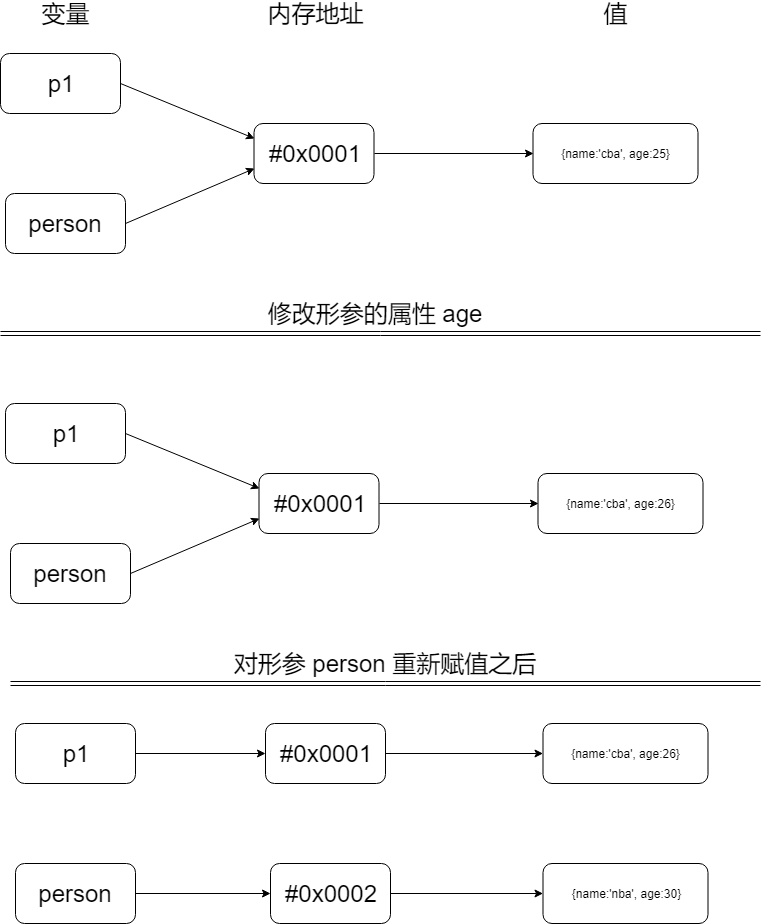
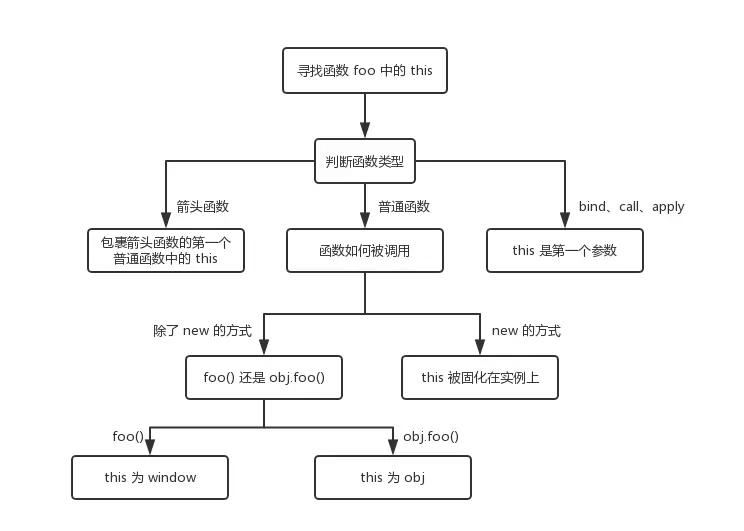

# JavaScript基础知识

## 数据类型

* 原始类型(Primitive Type)
* 对象类型(Object Type)

需要注意的是，`JavaScript` 中只有 ”值“ 才有类型，而变量是没有类型的概念的。

### 原始类型

MDN 中对原始值的定义
> 除 Object 以外的所有类型都是不可变的（值本身无法被改变）。例如，与 C 语言不同，JavaScript 中字符串是不可变的（译注：如，JavaScript 中对字符串的操作一定返回了一个新字符串，原始字符串并没有被改变）。我们称这些类型的值为“原始值”。

原始类型的值都会存放在栈内存中，因此我们读取原始类型的值会非常地快。

* `boolean` 仅包含两个值：`true` 和 `false`
* `number`  用于整数和浮点数
* `string`  用于字符串。一个字符串可以包含一个或多个字符，所以没有单独的单字符类型
* `undefined` 用于未定义的值 —— 只有一个 undefined 值的独立类型
* `null`  用于未知的值 —— 只有一个 null 值的独立类型
* `symbol`  用于唯一的标识符
* `bigint` 一种用于表示任意经读的数字类型

在 `JavaScript` 中，变量是没有类型的，但值有类型区分。

#### `number`

除了常规的整数和浮点数，`number` 还包括所谓“特殊数值” - `Infinity`, `-Infinity` 和 `NaN` 

#### 关于原始值的奇怪的点

由于原始类型存储的都是值，所以它们是没有函数可以调用的。

```js
undefined.toString()  // Uncaught TypeError: Cannot read property 'toString' of undefined
```

当时在我们的平时的开发过程中，我们经常会写出这种代码：

```js
'test'.toString()
```

这种情况下，`test` 已不再是原始类型了，它被强制转换成了 `String` 类型，也就是对象类型，因此可以调用 `toString` 方法。

除了这种强制类型转换的情况，还有 `==` 相等造成的强制类型转换，这里参考[颜海镜大大翻译的ES5文档](http://yanhaijing.com/es5/#203)。

除了强制类型转换的坑，原始类型还有其他的坑。

在JavaScript中 `number` 是浮点类型的，并且JavaScript遵循IEEE 754标准，这个标准中的浮点数并不能精确地表达小数（譬如0.1）

* 你需要足够的内存来保留5个数字
* 你需要使用一个取值范围来确保精度。

因此我们有时候会遇到类似如下地情况：

```js
0.1 + 0.2 == 0.3 // false
0.1 + 0.2 === 0.3 // false
0.1 + 0.2 // 0.30000000000000004
```

JavaScript中的小数采用的是双精度(64位)表示的，由三部分组成：　符 + 阶码 + 尾数，在十进制中的 1/10，在十进制中可以简单写为 0.1 ，但在二进制中，他得写成：0.0001100110011001100110011001100110011001100110011001…..（后面全是 1001 循环）。因为浮点数只有52位有效数字，从第53位开始，就舍入了。这样就造成了“浮点数精度损失”问题

[相关解释地参考 - Is floating point math broken?](https://stackoverflow.com/questions/588004/is-floating-point-math-broken)

另外对于 `null`，如果我们使用 `typeof null`，结果会返回 `object`，大部分人就会简单地认为 `null` 是对象类型。但实际上这是个JavaScript自身的bug。在 JS 的最初版本中使用的是 32 位系统，为了性能考虑使用低位存储变量的类型信息，000 开头代表是对象，然而 null 表示为全零，所以将它错误的判断为 object 。虽然现在的内部类型判断代码已经改变了，但是对于这个 Bug 却是一直流传下来。

> * 000: object. The data is a reference to an object.
> * 1: int. The data is a 31 bit signed integer.
> * 010: double. The data is a reference to a double floating point number.
> * 100: string. The data is a reference to a string.
> * 110: boolean. The data is a boolean.

[typeof null 的详细解释](http://2ality.com/2013/10/typeof-null.html)

## 对象类型

在JavaScript中除了原始类型之外其他的就都是对象类型了。对象类型和原始类型不同的是，原始类型存储的是值，对象类型存储的是地址。当你创建了一个对象类型的时候，计算机会在内存中帮我们开辟一个空间来存放值，但是我们需要找到这个空间，这个空间会拥有一个地址。这个地址将会存放在栈内存中，而它对应的值将会存放在堆内存中。

```js
const a = []
```

对于变量 `a` 来说，假设它的内存地址为 `#0x0001`（内存地址一般用4位16进制和8位16进制来表示） ，在这里变量 `a` 存放了地址 `#0x0001`，而地址 `#0x0001` 存放了值 `[]`。

```js
const a = []
const b = a
b.push(1)
```

当我们将变量赋值给另一个变量是，赋予的是原来变量的地址，也就是说变量 `b` 存放的值为 `#0x0001`，当我们进行数据修改的时候将会作用于地址对应的值，因此上述代码中 `a` 与 `b` 所代表的值为 `[1]`。

其实这个概念与C/C++中的指针、引用非常相似，即在JavaScript中对象类型的变量实际为某个值的引用，这些变量指向内存中某个地址，这些地址存放着对应的值。

如果我们将对象作为形参传入函数会发生什么呢？有C/C++基础的同学可以结合 `按值传递` 和 `引用传递` 的区别来理解。

```js
function test(person) {
  person.age = 26
  person = {
    name: 'nba',
    age: 30
  }

  return person
}
const p1 = {
  name: 'cba',
  age: 25
}
const p2 = test(p1)
console.log(p1) // {name: "yck", age: 26}
console.log(p2) // {name: "yyy", age: 30}
```

这中间到底发生了什么呢？我们来逐行解析看看

```js
// 这里纯粹是声明了一个函数，person 为形参
function test(person) {
  person.age = 26 // 修改了形参属性
  person = {      // 对形参进行重新赋值（请注意这里）
    name: 'nba',
    age: 30
  }

  return person   // 返回形参
}
```

这里有个地方需要我们特别注意一下，在函数内我们对形参进行了重新赋值，这时候它存放的内存地址将会改变，变成 `{name: 'nba', age: 30}` 对应的内存地址。其实我们只需要假设一个临时变量来理解就会非常好理解。

```js
function test(person) {
  person.age = 26
  // 假设一个临时变量
  var tmp = {
    name: 'nba',
    age: 30
  }
  person = tmp  // 重新赋值
  tmp = null  // 释放临时变量所占用的内存，为何要释放它，大家可以结合内存泄漏和JavaScript的垃圾回收机制思考一下。

  return person
}
```

这下就很清晰了，`p2` 将被赋予 `test(p1)` 返回的值，即代码中的临时值对应的值 `{name: "nba", age: 30}`。

那 `p1` 呢？它的值是否发生了改变呢？答案是肯定的，在调用 `test(p1)` 时，形参 `person` 将被赋予 `p1` 同样的内存地址，因此执行 `person.age = 26` 时，`p1` 对应的 `age` 属性的值也将变为 `26`。

有同学会问那为什么对形参 `person` 重新赋值的时候，`p1` 不会受到影响呢？原因能简单，就是我们上文所说的，对象类型它存放的是值的内存地址，而非值本身。在对形参 `person` 重新赋值的时候， `person` 它指向的内存地址发生了改变，即 `p1` 的内存地址与形参 `person` 的内存地址已经不相同了，所以 `person` 往后发生任何事都与 `p1` 没有任何关系。

将上述文字归纳为图，如下图：




## typeof & instanceof

JavaScript中有两种类型判断的内置方法，一个为 `typeof`，一个为 `instanceof`。接下来我们就来探讨探讨两者之间的区别。

### typeof

`typeof` 主要用于检查原始类型。除了 `null` 之外它都能正确返回对应的原始类型。在用 `typeof` 来检查对象类型时，他会不止返回 `object`。譬如检查函数时，它会返回 `function`；其他的对象类型均返回 `object`。

```js
typeof {} // 'object'
typeof function () {} // 'function'
```

### instanceof

`instanceof` 运算符用于测试构造函数的 `prototype` 属性是否出现在对象的原型链中的任何位置。这个方法可较准确地判断一个对象的类型。

但是，我们要注意概念中最关键的一点：“用于测试构造函数的 `prototype` 属性是否出现在对象的原型链中的任何位置”。因此并不是所有对象都是 `Object` 的实例。譬如：

```js
Object.create(null) instanceof Object // false
```

[objects that are not instances of Object](http://speakingjs.com/es5/ch17.html#_pitfall_objects_that_are_not_instances_of_object)

`typeof` 可以简单判断对象类型，但 `instanceof` 却无法直接判断原始类型。不过我们还有方法做到，只需要利用 `Symbol.hasInstance`。

`Symbol.hasInstance` 用于判断某对象是否为某构造器的实例。因此我们可以用它自定义 `instanceof` 操作符在某个类上的行为。

```js
class PrimitiveNumber {
  static [Symbol.hasInstance](x) {
    return typeof x === 'number'
  }
}
console.log(123 instanceof PrimitiveNumber) // true
```

由此可见使用 `instanceof` 来判断对象类型也并不是绝对可靠的。

[typeof & intanceof 相关的参考文章](http://2ality.com/2017/08/type-right.html)

## 原始类型常见的三种类型转换

在我们做一些计算操作的时候，经常会发生一些类型转换，那它们的转换规则又是怎么样的呢？

* `ToString` - 输出内容时 `ToString` 发生转换，或通过 `String(value)` 进行显式转换。原始类型值的 `string` 类型转换通常式可预见的。即 `null` 变成 `"null"`，`true` 变成 `"true"。

* `ToNumber` - 进行算术操作时发生 `ToNumber` 转换，或通过 `Number(value)` 进行显式转换。
* `ToBoolean` - 进行逻辑操作时发生 `ToBoolean` 转换。或通过 `Boolean(value)` 进行显式转换。

### `ToString` 转换遵循以下规则：

[ECMA参考](https://www.ecma-international.org/ecma-262/9.0/index.html#sec-tostring)

| 原始值                                             | 转换后的值       |
| -------------------------------------------------- | ---------------- |
| `undefined`, `null`, `boolean`, `number`, `string` | 所见即所得       |
| `symbol`                                           | 抛出 `TypeError` |

特殊情况：

* -0 --> "0"
* 当我们对数组做 `ToString` 的处理时，`JavaScript` 会将方括号和 `undefined`、`null` 过滤掉
* 当我们对普通对象做 `ToString` 的处理时，`JavaScript` 会加上方括号

```js
[] ->> ""
[1,2,3] ->> "1,2,3"
[null, undefined] ->> ","
[[[], [], []], []] ->> ",,,"
[,,,,] ->> ",,,"
[1, null, undefined] ->> "1,,"

{} ->> "[object Object]"
{a:2} ->> "[object Object]"
{toString(){return "X"}} ->> "X"
```

### `ToNumber` 转换遵循以下规则：

[ECMA参考](https://www.ecma-international.org/ecma-262/9.0/index.html#sec-tonumber)

| 原始值       | 转换后的值                                                             |
| ------------ | ---------------------------------------------------------------------- |
| `undefined`  | `NaN`                                                                  |
| `null`       | `0`                                                                    |
| `true/false` | `1/0`                                                                  |
| `string`     | 字符串“按原样读取”，两端的空白被忽略。空字符串变成 0。出错变成 NaN。 |
| `Symbol`     | 抛出 `TypeError`                                                       |

强制转换的万恶之源 - 空字符串

为什么会说空字符串是强制转换的万恶之源呢？其实很好理解，`Number("")` 返回 `0`，`Number("0")` 也返回 `0`；难道空字符串 `""` 可以用数字 `0` 来表达吗？当然不行！不过 `JavaScript` 没有提供更好的选择给我们。

空字符串还有一种情况，就是只包含空格、换行等的字符串。

```js
"" ->> 0
"0" ->> 0
"-0" ->> -0
" 009 " ->> 9
"3.14159" ->> 3.14159
"0." ->> 0
".0" ->> 0
"." ->> NaN
"0xaf" ->> 175
"    \t\n" ->> 0

false 0
true  1
null  0
undefined NaN
```

对 `true` 和 `false` 做 `ToNumber` 处理时分别返回 `1` 和 `0`，看起来也算是挺正常；因为其他不少编程语言中 `0` 和 `1` 也表示了 `true` 和 `false`。

`null` 会变成 `0`，额，看起来也没什么问题；但是为什么 `undefined` 会变成 `NaN` 呢？这两个为什么不统一起来呢？

当我们对数组或者普通对象类型做 `ToNumber` 处理时，它的期望值为 `number`，因此它会首先调用 `valueOf`，如果我们没用覆写这个方法的话，`valueOf` 将会返回 `this`；这时候仍然没有得到期望值的类型，进而它会调用 `toString`

```js
(for [] and {} by default):
valueOf { return this } --> toString()

[""] ->> 0
["0"] ->> 0
["-0"] ->> -0
[null] ->> 0
[undefined] ->> 0
[1,2,3] ->> NaN
[[[[]]]] ->> 0
```

问题又来了，为什么 `[null]` 和 `[undefined]` 都会返回 `0` 呢？结合上面的描述，你就可以很好的理解。

`Number([null])` 和 `Number[undefined]` 实际上等于 `Number([null].toString())` 和 `Number([undefined].toString())`，其中内部的值都变成了万恶之源 - 空字符串。

### `ToBoolean` 转换遵循以下规则：

[ECMA参考](https://www.ecma-international.org/ecma-262/9.0/index.html#sec-toboolean)

| 原始值                                | 转换后的值 |
| ------------------------------------- | ---------- |
| `0`, `null`, `undefined`, `NaN`, `""` | `false`    |
| 其他值                                | `true`     |

## 对象类型转原始类型

[ECMA参考](https://www.ecma-international.org/ecma-262/9.0/index.html#sec-ordinarytoprimitive)

对象到原始值的转换，是由许多内置函数和操作符自动调用的，这些函数使用一个原始值作为返回值的。

它也有三种转换后的类型（期望）

* `"string"` （对于 `alert` 和其他字符串转换）
* `"number"` （对于 `maths`计算操作）
* `"default"` （少数操作）

转换的算法逻辑如下：
1. 调用 `obj[Symbol.toPrimitive](hint)` 如果这个方法存在的话
2. 否则如果期望是 `"string"`
   * 尝试 `obj.toString()` 和 `obj.valueOf()`，无论哪个存在
3. 否则，如果期望是 `"number"` 或者 `"default"`
   * 尝试 `obj.valueOf()` 和 `obj.toString()`，无论哪个存在

```js
let a = {
  valueOf() {
    return 0
  },
  toString() {
    return '1'
  },
  [Symbol.toPrimitive]() {
    return 2
  }
}
1 + a // => 3

let b = {
  valueOf() {
    return 0
  },
  toString() {
    return 'b'
  }
  }
}
1 + b // -> 1
alert(b)  // "b"
```

## `this`

对于 `this` 可以参考下图，这里就暂时不展开讨论


