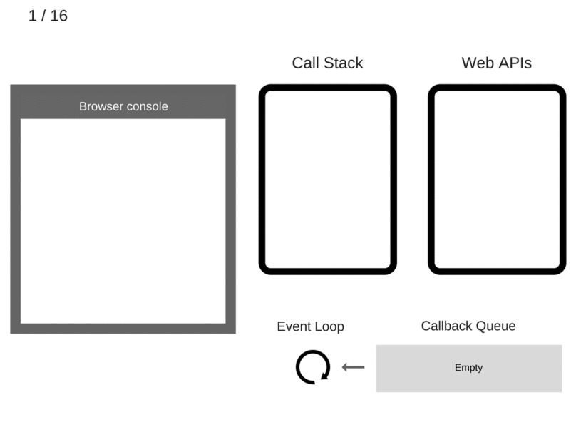

# 事件轮询(Event Loop)

## 单线程

在了解事件轮询前，我们首先要对单线程有个大概的概念。我们都知道JavaScript运行的环境是单线程的，单线程也就意味着在我们的调用栈（Callback Stack）中，如果调用某个
函数时，这个函数包含了复杂的计算过程，这时候我们的程序就会被阻塞。譬如我们经常可以看到有些页面的展示和交互都无法正常运作；这样就会破坏了我们的用户体验。

## JavaScript程序的组成

我们都知道虽然JavaScript是单线程的，但是在程序真正运行时，它却不是真正地一行一行运行的、这也是我们常说的异步。譬如：

```js
var res = $.ajax('https//example.com/api')
console.log(res)  // undefined
```

为了解决上述问题，我们引入了回调（callback）的概念。

```js
$.ajax('https//example.com/api', (res) => {
  console.log(res)  // show the response data
})
```

当然我们可以使用同步的Ajax请求，但请永远不要这样使用。从上文我们可以知道如果发生了某个同步的请求，下面的所有程序都会处于等待状态，进而影响用户的正常使用。

```js
$.ajax({
    url: 'https://api.example.com/endpoint',
    success: function(response) {
        // This is your callback.
    },
    async: false // 千万不要这么做
})

var request = new XMLHttpRequest()
request.open('GET', '/api/foo', false)  // false 使得请求同步化
request.send(null)
```

当然不单单是请求才有回调的应用。譬如我们常见的 `setTimeout`：

```js
function first() {
    console.log('first')
}
function second() {
    console.log('second')
}
function third() {
    console.log('third')
}

first()
setTimeout(second, 1000)
third()

// first
// third
// second
```

### 解析事件轮询

我们先简单地讲JavaScript程序分为图中几个模块


[Web API接口参考](https://developer.mozilla.org/zh-CN/docs/Web/API)

事件轮询到底是什么呢？简单来说，事件轮询有一个简单地工作，就是监视调用堆栈和回调队列。如果调用堆栈为空，它会将队列中的第一个事件取出来，然后压进调用堆栈中，再运行它。

这个迭代的过程在事件轮询中就称为 `tick`。每个事件也就是一个回调函数。

我们来解析以下代码看看它是如何工作的

```js
console.log('Hi')
setTimeout(function cb1() { 
    console.log('cb1')
}, 5000)
console.log('Bye')
```

1. 首先初始化阶段，所有状态都是干净的，调用堆栈是空的


2. 将 `console.log('Hi')` 加入调用堆栈


3. 执行 `console.log('Hi')`


4. 从调用堆栈中移除 `console.log('Hi')`


5. 将 `setTimeout(function cb1() {... })` 加入调用堆栈


6. 执行 `setTimeout(function cb1() {... })`，浏览器一个 `timer` 作为 Web API的一部分，它将为我们处理倒计时。


7. 从调用堆栈中移除 `setTimeout(function cb1() {... })`


8. 将 `console.log('Bye')` 加入调用堆栈


9. 执行 `console.log('Bye')`


10. 从调用堆栈中移除 `console.log('Bye')`


11. 等待至少5秒，倒计时完成，然后它将 `cb1` 回调函数压进调用队列中。


12. 事件轮询将 `cb1` 从调用队列中取出，并将它放进调用堆栈中。


13. 执行 `cb1`，将 `console.log('cb1')` 加入调用堆栈


14. 执行 `console.log('cb1')`


15. 从调用堆栈中移除 `console.log('cb1')`


16. 从调用堆栈中移除 `cb1`


完整的流程：



## 事件轮询深度解析

* 宏任务(Macrotasks) `script`, `setTimeout`, `setInterval`, `setImmediate`, `I/O`, `UI rendering`
* 微任务(Microtasks) `process.nextTick`, `promise`, `Object.observe`, `MuationObserver`

结合了宏任务和微任务的事件轮询的执行顺序又会是怎么样的呢？

先说结论：

* 首先执行同步代码，这属于宏任务。
* 当执行完所有同步代码后，执行栈为空，查询是否有异步代码需要执行。
* 执行所有微任务
* 当执行完所有微任务后，如有必要会渲染页面
* 然后开始下一轮的时间轮询，执行宏任务中的异步代码，也就是 `setTimeout` 中的回调函数
