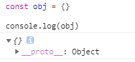
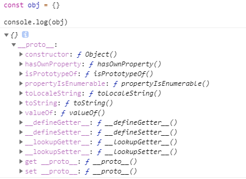
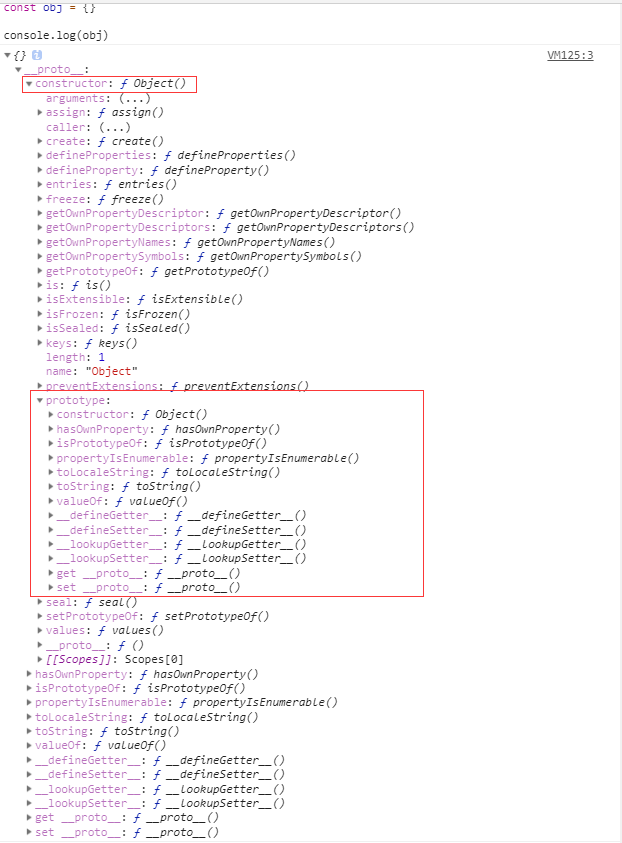

# 原型基础概念的拓展

## 预备知识

在第九章里，我们了解基础的原型 `prototype` 的概念，本章将拓展介绍它的应用及 JavaScript 中的继承是怎么实现的

在开始之前，我先介绍并解释 `__proto__` 的概念，及其与 `prototype` 的关系。

我们经常可以看到对象类型上都有这么一个属性 `__proto__`

```js
const obj = {}

console.log(obj)  // __proto__: Object
```



它又什么呢？我们在上一章了解到，所有的函数对象都会又个预设的属性，即 `prototype`，而 `__proto__` 就是所有对象都有的属性。并且它也是一个对象，**它指向了原型**。是不是感觉突然画风一转。其实这个属性存在的原因是浏览器在早期为了让我们能访问到内部属性 `[[prototype]]` 而实现的，在现在来说我们是不推荐使用它的；而使用 `Object.getPrototypeOf(instance)` 来解决问题。

听起来还没很模糊是吧？我们再来看看 `__proto__` 里面究竟有些什么东西



我们可以注意到 `__proto__` 对象上有很多种方法，因此对于 `obj` 来说，可以通过 `__proto__` 找到一个原型对象，在该原型对象中定义了很多方法供我们使用。

如果我们再展开 `__proto__.constructor`



我们发现在这个 `constructor` 属性里有一个 `prototype` 的属性，这个属性和前面的 `__proto__` 完全一模一样。所以我们可以得出一个结论：原型的 `constructor` 属性指向构造函数，构造函数又通过 `prototype` 属性指回原型，但是并不是所有函数都具有这个属性，`Function.prototype.bind()` 就没有这个属性。

```js
console.log(obj.constructor.prototype === obj.__proto__)  // true
console.log(obj.__proto__.constructor.prototype === obj.__proto__)  // true
```

再结合上一章最后的一张图，我们就能队原型和原型链有个清晰的认识了。


什么是原型链呢？其实原型链就是多个对象通过 `__proto__` 的方式连接了起来。为什么 `obj` 可以访问到 `valueOf` 函数，就是因为 `obj` 通过原型链找到了 `valueOf` 函数。

总结：

* `Object` 是所有对象的爸爸，所有对象都可以通过 `__proto__` 找到它
* `Function` 是所有函数的爸爸，所有函数都可以通过 `__proto__` 找到它
* 函数的 `prototype` 是一个对象
* 对象的 `__proto__` 属性指向原型， `__proto__` 将对象和原型连接起来组成了原型链

## Arrary 的内置方法

我们经常会这样来创建一个数组对象

```js
const friends = []
```

其实这是一种创建数组实例的语法糖，即等同于：

```js
const friends = new Array()
```

我们都知道数组对象可以使用一些内置的方法，譬如：`splice`, `slice`, `push`, `pop` 等等。但这些方法是怎么来的呢？其实这些方法就存在与 `Array.prototype` 上。

```js
console.log(Array.prototype)
/*
  concat: ƒ concat()
  constructor: ƒ Array()
  copyWithin: ƒ copyWithin()
  entries: ƒ entries()
  every: ƒ every()
  fill: ƒ fill()
  filter: ƒ filter()
  find: ƒ find()
  findIndex: ƒ findIndex()
  flat: ƒ flat()
  flatMap: ƒ flatMap()
  forEach: ƒ forEach()
  includes: ƒ includes()
  indexOf: ƒ indexOf()
  join: ƒ join()
  keys: ƒ keys()
  lastIndexOf: ƒ lastIndexOf()
  length: 0
  map: ƒ map()
  pop: ƒ pop()
  push: ƒ push()
  reduce: ƒ reduce()
  reduceRight: ƒ reduceRight()
  reverse: ƒ reverse()
  shift: ƒ shift()
  slice: ƒ slice()
  some: ƒ some()
  sort: ƒ sort()
  splice: ƒ splice()
  toLocaleString: ƒ toLocaleString()
  toString: ƒ toString()
  unshift: ƒ unshift()
  values: ƒ values()
  Symbol(Symbol.iterator): ƒ values()
  Symbol(Symbol.unscopables): {copyWithin: true, entries: true, fill: true, find: true, findIndex: true, …}
  __proto__: Object
*/
```

这种行为在对象类型上都有体现。譬如我们可以在 `Object.prototype` 上找到 `hasOwnProperty`，也就是所有对象类型都能使用这个方法。

## 静态方法

到这里，我们明白了为什么及如何在实例间共享方法。然而如果我们需要有种方法只供类使用，不共享与实例间呢？假设我们有个方法，接受一组以 `Animal` 实例为数组的参数，然后决定哪只动物先被喂养。

```js
function nextToEat (animals) {
  const sortedByLeastEnergy = animals.sort((a, b) => {
    return a.energy - b.energy
  })

  return sortedByLeastEnergy[0].name
}
```

如果把 `nextToEat` 放在 `Animal.prototype` 上，那就不满足不共享于实例间的条件了。那我们先把它放在外边

```js
class Animal {
  constructor(name, energy) {
    this.name = name
    this.energy = energy
  }
  eat(amount) {
    console.log(`${this.name} is eating.`)
    this.energy += amount
  }
  sleep(length) {
    console.log(`${this.name} is sleeping.`)
    this.energy += length
  }
  play(length) {
    console.log(`${this.name} is playing.`)
    this.energy -= length
  }
}

function nextToEat (animals) {
  const sortedByLeastEnergy = animals.sort((a,b) => {
    return a.energy - b.energy
  })

  return sortedByLeastEnergy[0].name
}

const leo = new Animal('Leo', 7)
const snoop = new Animal('Snoop', 10)

console.log(nextToEat([leo, snoop])) // Leo
```

看起来不错，但我们有更好的方法，那就是利用 `class` 的 `static` 关键字

```js
class Animal {
  constructor(name, energy) {
    this.name = name
    this.energy = energy
  }
  eat(amount) {
    console.log(`${this.name} is eating.`)
    this.energy += amount
  }
  sleep(length) {
    console.log(`${this.name} is sleeping.`)
    this.energy += length
  }
  play(length) {
    console.log(`${this.name} is playing.`)
    this.energy -= length
  }
  static nextToEat(animals) {
    const sortedByLeastEnergy = animals.sort((a,b) => {
      return a.energy - b.energy
    })

    return sortedByLeastEnergy[0].name
  }
}
```

使用 `static` 在类里定义方法，这个方法就只能供类所使用。

```js
const leo = new Animal('Leo', 7)
const snoop = new Animal('Snoop', 10)

console.log(Animal.nextToEat([leo, snoop])) // Leo
```

上述是 ES6 的写法，如果转化为 ES5 又如何写呢？

```js
function Animal (name, energy) {
  this.name = name
  this.energy = energy
}

Animal.prototype.eat = function (amount) {
  console.log(`${this.name} is eating.`)
  this.energy += amount
}

Animal.prototype.sleep = function (length) {
  console.log(`${this.name} is sleeping.`)
  this.energy += length
}

Animal.prototype.play = function (length) {
  console.log(`${this.name} is playing.`)
  this.energy -= length
}

Animal.nextToEat = function (nextToEat) {
  const sortedByLeastEnergy = animals.sort((a,b) => {
    return a.energy - b.energy
  })

  return sortedByLeastEnergy[0].name
}

const leo = new Animal('Leo', 7)
const snoop = new Animal('Snoop', 10)

console.log(Animal.nextToEat([leo, snoop])) // Leo
```

其实很简单，只需要将方法绑定在类上即可。
